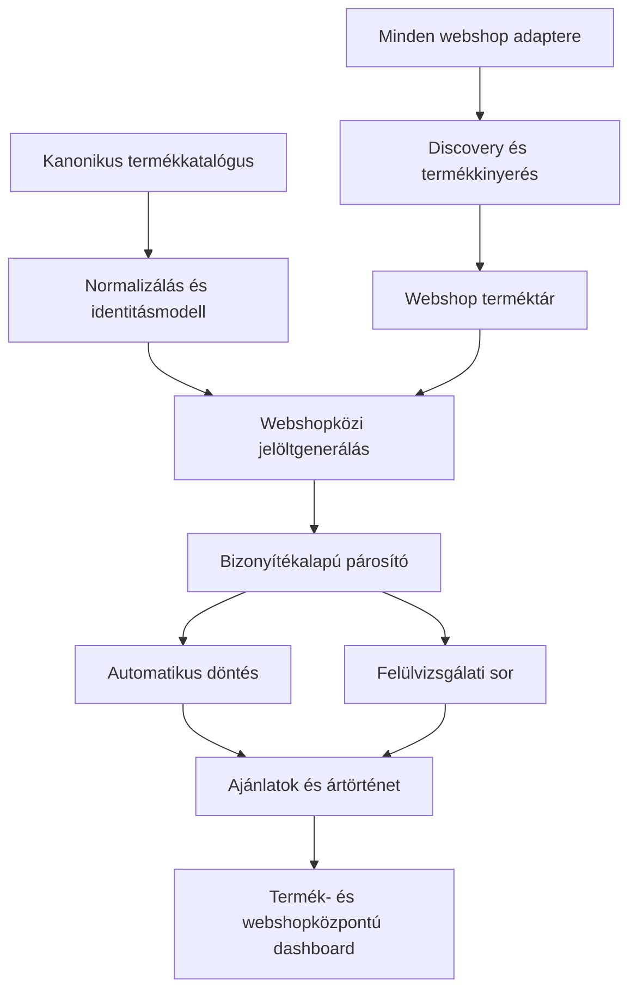
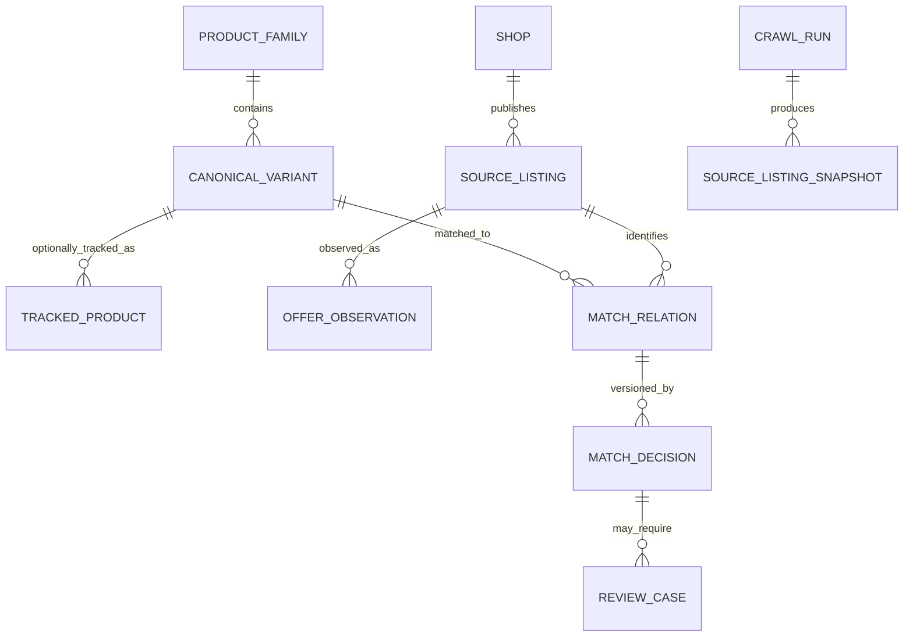
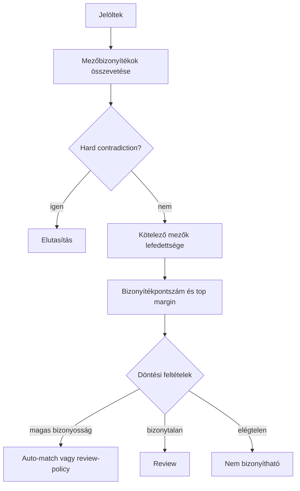

# Webshopközi italár-figyelő és termékazonosító rendszer

## Teljes funkcionális és műszaki specifikáció – V2.1

**Verzió:** 2.1  
**Dátum:** 2026. augusztus 30.  
**Státusz:** fejlesztésre átadható célrendszer-specifikáció

**Dokumentum célja:** olyan, önmagában is használható fejlesztési specifikáció biztosítása, amelyet egy vibe coding platform vagy fejlesztőcsapat megkaphat a teljes rendszer megtervezéséhez, lefejlesztéséhez, teszteléséhez és üzembe helyezéséhez.

**Elsődleges üzleti cél:** bármely felderített vagy kézzel felvitt italtermék valóban azonos változatainak aktuális magyarországi webshopárait megbízhatóan megtalálni, eltárolni és összehasonlítható formában megjeleníteni. Egyetlen webshop – így a RADOVIN – sem kötelező vagy kiemelt referenciaforrás.

**Kiemelt prioritás:** a helyes termékpárosítás. A rendszer inkább jelezzen bizonytalanságot és kérjen emberi ellenőrzést, mint hogy egy hasonló, de eltérő évjáratú, kiszerelésű, kiadású vagy csomagolású termék árát jelenítse meg.

**Nyelv és pénznem:** magyar felület, HUF alapú árak. A belső mező- és API-nevek angolul legyenek, hogy a kód egységes, jól dokumentálható és nemzetközi eszközökkel könnyen kezelhető maradjon.

### V2.1 kiegészítés – webshop-semleges működés

A rendszer teljes termék- és párosítási modellje webshop-semleges. A crawling során megtalált összes listing bekerül a terméktárba, és a rendszer akkor is keresi más webshopokban az azonos termékváltozatokat, ha azt a RADOVIN nem forgalmazza.

A felhasználó két egyenrangú nézetből dolgozhat:

1. **Termékközpontú nézet:** bármely kanonikus terméket vagy bármely webshop listingjét kiválasztva megtekintheti az összes megtalált, azonos termékváltozat árát.
2. **Webshopközpontú nézet:** bármely webshopot – köztük a RADOVIN-t – kiinduló webshopként kiválasztva megtekintheti az ott található termékek más webshopokban elérhető azonos változatait és árait.

A „kiinduló webshop” csak felületi szűrő és összehasonlítási nézőpont. Nem válik az adatmodell vagy a matching kötelező baseline-jává.

---

## 0. A korábbi rendszer kezelése

A korábbi `SPEC`, `LESSONS` és `RADOVIN_SYSTEM_IMPROVEMENT_GUIDE` anyagok tanulságként használhatók, de nem tekintendők követendő célarchitektúrának.

### Megtartandó tanulságok

- A teljes, strukturált webshopkatalógus letöltése általában megbízhatóbb és gyorsabb, mint minden kiinduló termék külön keresése.
- A strukturált API, feed, JSON-LD és beágyazott termékadat előnyt élvez a DOM-szelektorokkal és headless böngészővel szemben.
- A terméknév, a slug és a kategória önmagában nem bizonyítja a termékazonosságot.
- A kiszerelés, darabszám, évjárat, kiadás, korjelölés és csomagolás eltérése kizárhatja a párosítást.
- A technikai forráshibát külön kell választani attól, hogy a webshopban nincs találat.
- A rendszernek meg kell őriznie a nyers forrásnevet, a linket, a kinyerés módját, a döntési bizonyítékokat és az elutasítás okát.
- A megszakadt futás nem írhatja felül az utolsó teljes, jó állapotú eredményt.

### Nem továbbvihető irányok

- Egyetlen `fajta` mező nem modellezheti sem a termék teljes identitását, sem az összes webshop eltérő elnevezését.
- Egy másik webshop pontos megnevezésének kézi beírása nem lehet a találat feltétele.
- A névegyezésre és néhány kulcsszóra épülő „legjobb találat” kiválasztása nem elég biztonságos.
- A kézzel előre jóváhagyott URL-ek használata gyorsíthatja a későbbi árfrissítést, de nem helyettesítheti az új termékek automatikus felderítését és a kapcsolat újraellenőrzését.
- Az LLM vagy embedding hasonlóság nem lehet a végső termékazonossági döntés egyetlen alapja.
- A Git-repository nem használható hosszú távú futásidejű adatbázisként.
- A statikus weboldalba épített bejelentkezés nem valódi jogosultságkezelés.

### Migrációs szabály

A korábbi rendszerből származó RADOVIN-központú párosítások `legacy_unverified` állapotban importálhatók. Csak élő forrásból történő újraellenőrzés után válhatnak `verified` állapotú, webshop-semleges kanonikus kapcsolattá. A régi párosítás, ár vagy URL önmagában nem számít bizonyítéknak.

---

## 1. Vezetői összefoglaló

A rendszer nem egyszerű ár-scraper. Négy, egymástól elkülönített feladatot kell megoldania:

1. **Kanonikus termékkatalógus kezelése:** a webshopoktól független, pontos termékváltozatok létrehozása, strukturálása, összevonása és jóváhagyása.
2. **Piaci termékfelderítés:** az összes bevont webshop katalógusának rendszeres, webshopfüggő feltérképezése és minden megtalált listing eltárolása.
3. **Webshopközi termékazonosítás:** ugyanannak a forgalmazható termékváltozatnak a felismerése bármely két vagy több webshop között, eltérő nevek, mezők, oldalszerkezetek és hiányos adatok mellett.
4. **Árfigyelés és megjelenítés:** az egy kanonikus termékváltozathoz tartozó összes igazolt webshop-ajánlat ártörténetének követése, valamint a teljes piac vagy egy szabadon kiválasztott webshop helyzetének kiszámítása.

A párosítás új alapelve:

> **Többcsatornás jelöltkeresés + strukturált attribútumkinyerés + kizáró ellentmondások + bizonyítékalapú pontozás + bizonytalanság esetén tartózkodás vagy emberi döntés.**

„Biztosan működő” rendszer kizárólag úgy készíthető, ha a rendszernek engedélyezett a `nem bizonyítható` válasz. A cél nem mindenáron a 100%-os automatikus találati arány, hanem a gyakorlatilag hibamentes automatikus párosítás, és a fennmaradó esetek gyors, jól támogatott kézi elbírálása.

### A rendszer legfontosabb garanciái

- Hibás vagy bizonytalan termék ára nem kerülhet be automatikusan az összehasonlításba.
- Egyetlen keresési hiba nem eredményezhet „nincs ilyen termék” állapotot.
- A találat minden lényeges attribútuma és bizonyítéka visszanézhető.
- A már igazolt webshoplisting–kanonikus termék kapcsolatokat minden árfrissítéskor identitás-eltolódásra is ellenőrizni kell.
- Új webshop külön adapterként hozzáadható a központi párosító és frontend átírása nélkül.
- A szabályok, küszöbértékek és taxonómiák verziózottak és auditálhatók.

---

## 2. Hatókör

### 2.1 Első éles fejlesztési kör

#### Borwebshopok

1. Bortársaság – `https://www.bortarsasag.hu/`
2. Veritas Borkereskedés – `https://www.borkereskedes.hu/`
3. Winelovers Webshop – `https://wineloverswebshop.hu/`
4. Borháló – `https://www.borhalo.com/` vagy a ténylegesen működő kanonikus host
5. Winehub – `https://winehub.hu/`

#### Töményital-webshopok

1. iDrinks – `https://idrinks.hu/`
2. WhiskyNet – `https://www.whiskynet.hu/`
3. GoodSpirit – `https://goodspirit.hu/`
4. Mr. Alkohol – `https://www.mralkohol.hu/`
5. Italshop – `https://italshop.hu/`

Minden domaint az adapter fejlesztésekor újra fel kell mérni. Nem szabad feltételezni, hogy a korábban tapasztalt WooCommerce-, Shopify-, JSON-LD-, GA4- vagy headless-megoldás jelenleg is változatlanul működik.

### 2.2 Későbbi bővítés

A konfiguráció és az adapterrendszer támogassa további bor- és töményital-webshopok felvételét kódmódosítás nélkül ott, ahol általános adapter használható, illetve elkülönített kiegészítő modullal ott, ahol egyedi kinyerés szükséges.

Tervezett további borforrások: Pannon Borbolt, Borbolt.hu, Borvilág, BorPont, A Bor / the WINE, Borkell, Borválogatás, Benebor és Capri Borpiac.

Tervezett további töményital-források: Diszkontital, Alkoholnet, PálinkaShop, Golden Drinks, Italdepo, Italcenter, Drinkmix, Drinkcentrum, Italpark és Italnagyker24.

Ezek a nevek roadmap-elemek. Aktiválásuk előtt ugyanazt a forrásfelmérési, jogi/policy-, adapter- és tesztfolyamatot kell végrehajtani, mint az első körös webshopoknál.

### 2.3 A fejlesztés része

- adminisztrációs webfelület;
- felhasználói ár-összehasonlító dashboard;
- kanonikus termékkatalógus és opcionális figyelőlista importja és szerkesztése;
- webshopkatalógus-felderítés és crawling;
- webshopfüggő termék- és árkinyerés;
- terméknormalizálás és taxonómia;
- jelöltgenerálás és párosítás;
- bizonytalan találatok felülvizsgálati munkafolyamata;
- nem talált termékek ismételt és kibővített keresése;
- ár- és készlettörténet;
- webshop- és crawler-egészségmonitor;
- ütemezett háttérfeladatok;
- szerepkörök, hitelesítés és auditnapló;
- tesztelés, mérőszámok, migráció és dokumentáció.

### 2.4 Nem része az első körnek

- automatikus ármódosítás bármelyik webshopban;
- rendelésleadás bármely bevont webshopban;
- bejelentkezés mögötti, előfizetéses vagy nem nyilvános tartalom megszerzése;
- CAPTCHA vagy kifejezett technikai hozzáférés-védelem megkerülése;
- szállítási díjakból számított teljes kosárár-optimalizálás;
- fogyasztói értékelések vagy marketingtartalom összehasonlítása;
- mobilalkalmazás; a felület reszponzív webalkalmazás legyen.

---

## 3. Fogalmak és alapegységek

| Fogalom | Jelentés |
| --- | --- |
| `Product family` | Általános termékcsalád, például egy adott borászat adott bora vagy egy töményital-márka adott termékvonala. |
| `Canonical variant` | Pontosan összehasonlítható, forgalmazható termékváltozat: évjárat, kiszerelés, darabszám, csomagolás, kiadás stb. szerint meghatározva. |
| `Canonical product` | Webshoptól független termékcsalád és pontos termékváltozat, amelyhez több webshop listingje kapcsolódhat. |
| `Tracked product` | Opcionálisan kiemelten figyelt kanonikus termékváltozat. Az összehasonlíthatóság nem függ attól, hogy a termék szerepel-e a figyelőlistán. |
| `Merchant listing` | Egy adott webshopban található termékoldal vagy platformtermék/variáns. |
| `Offer` | Egy merchant listing adott időpontban megfigyelt ára, készlete és ajánlattípusa. |
| `Candidate` | Olyan webshoplisting, amelyet a jelöltkeresés egy kanonikus termékváltozat lehetséges tagjaként vagy egy másik webshoplisting lehetséges párjaként azonosított. |
| `Match relation` | Verziózott kapcsolat egy kanonikus termékváltozat és egy webshoplisting között. |
| `Anchor shop` | A felhasználó által az adott nézethez kiválasztott kiinduló webshop. Csak szűrési és összehasonlítási nézőpont, nem adatmodellbeli referencia. |
| `Evidence` | A kinyert mező, annak eredeti szövegrészlete, forráshelye, módszere és megbízhatósága. |
| `Hard contradiction` | Olyan bizonyított eltérés, amely kizárja, hogy a két rekord pontosan ugyanaz a termékváltozat legyen. |
| `Unknown` | Hiányzó vagy nem bizonyítható attribútum. Az `unknown` nem egyezés, de nem is automatikus ellentmondás. |
| `Source adapter` | Egy webshop felderítését, letöltését és kinyerését megvalósító modul vagy konfiguráció. |
| `Discovery run` | A webshop teljes vagy részleges termékkínálatát feltérképező futás. |
| `Price refresh` | Egy már ismert termékoldal árának és állapotának frissítése. |
| `Review case` | Emberi döntést igénylő párosítás, eltérés, árváltozás vagy adatminőségi eset. |

### 3.1 Mi számít azonos terméknek?

Az összehasonlítás alapértelmezésben **azonos eladható változatot** jelent, nem csupán azonos italt.

Példák:

- 0,75 l és 1,5 l: nem azonos;
- 0,7 l és 1 l: nem azonos;
- 2022-es és 2023-as bor: nem azonos;
- vintage és non-vintage pezsgő: nem azonos;
- 5 és 6 puttonyos aszú: nem azonos;
- sima palack és ajándékdoboz: alapértelmezésben nem azonos eladható változat;
- egy palack és 6 × 0,75 l karton: nem azonos;
- Johnnie Walker Black Label és Double Black: nem azonos;
- ugyanaz a palack akciós és normál áron: azonos termék, eltérő ajánlat/árállapot;
- elírt slug, de azonos oldalon igazolt név és attribútumok: a slug nem döntő.

Az admin termékenként engedélyezhet külön összehasonlítási szabályt, például a díszdoboz elfogadását, de az ilyen kivétel legyen explicit, indokolt és auditált.

---

## 4. Felhasználók és jogosultságok

### 4.1 Szerepkörök

| Szerepkör | Jogosultság |
| --- | --- |
| `viewer` | Dashboard, termékek, árak, ártörténet és forrásállapot megtekintése. |
| `reviewer` | Párosítási esetek jóváhagyása, elutasítása, más jelölt választása, megjegyzés hozzáadása. |
| `catalog_manager` | Kanonikus termékek és figyelőlisták importja, szerkesztése, összevonása és felfüggesztése; taxonómia-javaslatok kezelése. |
| `source_manager` | Webshopok, adapterek, keresési útvonalak, ütemezések és forrásteszt kezelése. |
| `admin` | Felhasználók, szerepkörök, rendszerbeállítások, küszöbértékek és auditnapló teljes kezelése. |

### 4.2 Hitelesítés

- Valódi szerveroldali hitelesítést kell használni.
- Jelszó hash-elve, erős algoritmussal tárolandó; alapértelmezett vagy kliensoldalba írt jelszó tilos.
- A session legyen biztonságos, `HttpOnly`, `Secure`, megfelelő `SameSite` beállítású cookie.
- Minden módosító végpont szerepkör-ellenőrzött és auditált legyen.
- Az első körben elegendő a meghívásos, zárt felhasználói rendszer; nyilvános regisztráció nem kell.

---

## 5. Fő üzleti folyamatok

### 5.1 Termék vagy figyelési igény felvitele

1. Admin egyesével, CSV- vagy XLSX-importtal felviszi a terméket, illetve kiindulhat bármely webshop meglévő listingjéből.
2. A rekord tartalmazhat tetszőleges webshoplinket, shop ID-t, SKU-t/EAN-t, nevet, árat és részleges attribútumokat.
3. A rendszer betölti a megadott linket, vagy megkeresi a terméket az összes már felderített webshopkatalógusban.
4. A kinyerő alrendszer strukturálja az adatokat és minden mezőhöz bizonyítékot rendel.
5. A rendszer megjelöli a hiányzó vagy ellentmondó identitásmezőket.
6. Admin ellenőrzi és jóváhagyja a kanonikus változatot.
7. Jóváhagyás után azonnal elindul a keresés minden aktív webshopban.

A kézi felvitel csak opcionális. A teljes katalógus-discovery során talált listingekből a rendszer automatikusan is létrehozhat `proposed` kanonikus termékváltozatot, majd más webshopokban azonnal keresheti annak párjait.

### 5.2 Új webshoptermék felderítése

1. A discovery worker letölti a webshop elérhető katalógusát vagy URL-listáját.
2. A detail worker lekéri és egységes rekorddá alakítja a termékoldalakat.
3. A termék bekerül a webshop teljes, böngészhető terméktárába akkor is, ha még egyetlen más webshop termékéhez sem párosítható.
4. A változásdetektor felismeri az új, eltűnt vagy módosult listingeket.
5. Az új vagy módosult rekordokra lefut a webshopközi jelöltgenerálás és párosítás minden más aktív webshop katalógusa ellen.
6. Ha nincs megfelelő kanonikus változat, a rendszer újat javasol; ha van, a listinget ahhoz kapcsolja vagy review-ba küldi.

### 5.3 Párosítás

1. A rendszer a kanonikus termékváltozat és/vagy egy kiválasztott webshoplisting alapján több keresési módszerrel jelölteket gyűjt az összes többi webshopból.
2. A jelöltek attribútumait háromállapotú mező-összehasonlítással értékeli: `match`, `contradiction`, `unknown`.
3. Hard contradiction esetén a jelölt kiesik.
4. A megmaradt jelölteket a bizonyítékok erőssége, lefedettsége és a második legjobb jelölthöz mért különbség alapján rangsorolja.
5. A döntés lehet automatikus párosítás, felülvizsgálat, bizonytalan/nem bizonyítható, vagy igazoltan nincs találat.
6. Minden döntés verziózott, magyarázható és visszakereshető.

### 5.4 Árfrissítés

1. Igazolt pároknál a rendszer elsőként a már ismert listing közvetlen linkjét vagy platformazonosítóját ellenőrzi.
2. Újra kinyeri a termékidentitás lényeges mezőit is, nem csak az árat.
3. Identitás-eltolódás esetén az ár nem publikálható; `mapping_drift` review case jön létre.
4. Az új ár, listaár, akciós ár, készletállapot és időpont megfigyelésként elmentődik.
5. Ár- vagy állapotváltozás külön eseményként naplózódik.

### 5.5 Nem talált termék újrakeresése

1. A rendszer ellenőrzi, hogy az adott webshop crawlja egészséges és kellően teljes volt-e.
2. Lefuttatja a szűk, majd fokozatosan táguló keresési tervet.
3. Felhasználja a más webshopokból újonnan megismert aliasokat, EAN-t, gyártói elnevezést és termékvonalat.
4. A korábbi elutasított jelölteket azonos forrásfingerprint mellett nem ajánlja fel újra.
5. Új vagy érdemben változott jelölt esetén újranyitja az esetet.
6. A `not_found` csak a keresési utak igazolt végrehajtása és egészséges forrás mellett adható.

---

## 6. Célarchitektúra



### 6.1 Logikai komponensek

- **Web app:** dashboard, admin, review queue, forrásmonitor.
- **API:** üzleti logika, hitelesítés, CRUD, riportok, review döntések.
- **Scheduler:** ismétlődő és azonnali feladatok létrehozása.
- **Queue/worker rendszer:** crawling, kinyerés, párosítás, árfrissítés, riportgenerálás.
- **Crawler runtime:** statikus HTTP és dinamikus browser mód.
- **Matching engine:** jelöltgenerálás, szabálymotor, pontozás, döntés.
- **PostgreSQL:** kanonikus adatok, forráslistingek, párok, ajánlatok, történet, audit.
- **Redis:** feladatsor, zárolás, rate limit és rövid életű cache.
- **Object storage:** hibaeseti, korlátozott megőrzésű HTML/JSON/screenshot bizonyítékok; nem publikus.
- **Monitoring:** strukturált logok, metrikák, riasztások és futásállapotok.

### 6.2 Ajánlott referencia-technológia

Az alábbi stack ajánlott, de azonos képességű alternatíva elfogadható, ha az interfészek és elfogadási kritériumok változatlanok maradnak.

| Réteg | Ajánlás |
| --- | --- |
| Monorepo | TypeScript, workspace-alapú felépítés |
| Frontend | Next.js + React + reszponzív komponenskönyvtár |
| Backend API | NestJS vagy Fastify alapú TypeScript API |
| Adatbázis | PostgreSQL; `pg_trgm`, teljes szöveges keresés, JSONB |
| ORM/migráció | Prisma, Drizzle vagy más migrációképes ORM |
| Queue | Redis + BullMQ vagy egyenértékű, tartós retry/backoff támogatással |
| HTTP crawling | Crawlee CheerioCrawler vagy közvetlen HTTP kliens |
| Dinamikus crawling | Crawlee PlaywrightCrawler / Playwright, csak szükség esetén |
| Objektumtár | S3-kompatibilis tárhely, például MinIO |
| Teszt | egység-, fixture-, integrációs és E2E-tesztek |
| Megfigyelhetőség | strukturált JSON log, futásmetrikák, opcionális OpenTelemetry |

Az embedding és `pgvector` opcionális jelölt-visszakeresési réteg. Nem kell az első működő verzió feltételeként bevezetni, és nem dönthet önállóan párosításról.

### 6.3 Telepítési modell

Kezdésként egyetlen szerveren futó moduláris monolit ajánlott külön web/API és worker processzekkel. Mikroszervizek nem szükségesek. Docker Compose vagy a meglévő telepítési platform használható.

Kötelező processzek:

- `web`;
- `api`;
- `worker-http`;
- `worker-browser` elkülönített, alacsony konkurenciával;
- `scheduler`;
- `postgres`;
- `redis`.

---

## 7. Projektstruktúra

```text
apps/
  web/
  api/
  worker-http/
  worker-browser/
  scheduler/
packages/
  domain/
    product-identity/
    matching/
    pricing/
    taxonomies/
  adapters/
    common/
    radovin/
    bortarsasag/
    veritas/
    winelovers/
    borhalo/
    winehub/
    idrinks/
    whiskynet/
    goodspirit/
    mralkohol/
    italshop/
  crawler-core/
  extraction/
  db/
  contracts/
  observability/
tests/
  fixtures/
  golden-matches/
  adapters/
  e2e/
docs/
  architecture/
  adapter-runbooks/
  matching-policy/
```

Minden webshop adaptere saját könyvtárat, fixture-öket, health checket és runbookot kapjon. A webshop-specifikus szelektor vagy kód nem kerülhet a központi párosítóba.

---

## 8. Adatmodell

### 8.1 Fő entitások



### 8.2 `product_families`

Általános, változatfüggetlen termékcsalád.

Fontos mezők:

- `id` UUID;
- `category` – wine, sparkling_wine, champagne, whisky, rum, gin, vodka, palinka, tequila, cognac, liqueur stb.;
- `producer_id` vagy `brand_id`;
- `canonical_name`;
- `product_line` / `expression`;
- `origin_country`, `region`, `appellation` opcionálisan;
- `status`;
- `created_at`, `updated_at`.

### 8.3 `canonical_variants`

A tényleges összehasonlítási egység.

- `id` UUID;
- `product_family_id`;
- `canonical_display_name`;
- `vintage_value` és `vintage_status` (`vintage`, `non_vintage`, `not_applicable`, `unknown`);
- `volume_ml`;
- `pack_count`;
- `packaging_type`;
- `age_statement_years`;
- `edition`, `batch`, `cask_finish`, `dosage_style`;
- `abv_percent`;
- `gtin`/EAN és egyéb gyártói azonosítók;
- `identity_profile_json` – kötelező és kiegészítő attribútumok;
- `comparison_policy_json`;
- `status`;
- `version`.

Egy automatikus összehasonlításra elfogadott kanonikus termékváltozat nem maradhat `unknown` értékű olyan mezővel, amelyet az identitásprofil kötelezőnek jelöl. A discovery során létrehozott hiányos változat `proposed` állapotban marad, amíg a szükséges bizonyítékok rendelkezésre nem állnak.

### 8.4 `tracked_products`

- `id` UUID;
- `canonical_variant_id`;
- `preferred_source_listing_id` opcionálisan, bármelyik webshopból;
- `tracking_origin`: `manual`, `import`, `shop_catalog`, `auto_discovery`;
- `tracking_label`, `priority`, `owner`;
- `active`, `suspension_reason`;
- `import_batch_id`;
- `approved_by`, `approved_at`;
- `created_at`, `updated_at`.

Ez a tábla csak figyelőlista- és munkaszervezési funkciót ad. Egy kanonikus változat akkor is kereshető és összehasonlítható, ha nincs hozzá `tracked_products` rekord.

### 8.5 `shops`

- `id`, `name`, `base_url`, `canonical_host`;
- `shop_group_id` – kapcsolt kereskedések jelölésére;
- `active`;
- `crawl_policy_id`;
- `adapter_key`, `adapter_version`;
- `discovery_strategy`;
- `price_refresh_interval`;
- `discovery_interval`;
- `rate_limit`, `max_concurrency`;
- `robots_last_checked_at`, `terms_last_checked_at`;
- `expected_catalog_min/max`;
- `health_status`.

### 8.6 `source_listings`

A webshopban talált termék vagy variáns stabil rekordja.

- `id` UUID;
- `shop_id`;
- `platform_product_id`, `platform_variant_id`, `sku`, `gtin`;
- `canonical_url`, `final_url`;
- `raw_name`, `normalized_name`;
- strukturált identitásmezők;
- `source_fingerprint`;
- `first_seen_at`, `last_seen_at`, `last_checked_at`;
- `availability_status`;
- `listing_status` (`active`, `missing`, `redirected`, `archived`, `blocked`);
- `latest_snapshot_id`;
- egyediség: elsőként `(shop_id, platform_product_id, platform_variant_id)`, ennek hiányában kontrollált kanonikus URL-kulcs.

### 8.7 `source_listing_snapshots`

- `listing_id`, `crawl_run_id`, `observed_at`;
- eredeti és normalizált név;
- kinyert mezők és mezőnkénti evidence;
- `content_hash`, `identity_hash`;
- `extractor_key`, `extractor_version`;
- `raw_artifact_ref` opcionálisan;
- parse warningok és minőségi pontszám.

### 8.8 `offer_observations`

- `listing_id`, `observed_at`, `crawl_run_id`;
- `price_amount` egész forintban;
- `currency`;
- `regular_price`, `sale_price`, `member_price` külön mezőben;
- `selected_comparable_price`;
- `price_type`;
- `vat_included`;
- `deposit_amount`;
- `unit_price` és `unit_basis`;
- `in_stock`, `availability_raw`;
- `valid_from`, `valid_to` ha ismert;
- `evidence`.

Az összehasonlításba alapértelmezésben a minden látogató számára elérhető, ÁFÁ-t tartalmazó, egy darabra vonatkozó aktuális eladási ár kerül. Klub-, kupon-, mennyiségi vagy kosárfeltételes ár külön jelölés nélkül nem hasonlítható más webshopok normál nyilvános árához.

### 8.9 `match_relations` és `match_decisions`

`match_relations`:

- `canonical_variant_id`;
- `source_listing_id`;
- `status`: `proposed`, `verified`, `rejected`, `suspended`, `drifted`;
- `decision_origin`: `auto`, `human`, `legacy_import`;
- `valid_from`, `valid_to`;
- `locked_by_human`;
- `current_decision_id`.

Integritási szabályok:

- egy source listingnek legfeljebb egy aktív `verified` kanonikus kapcsolata lehet;
- egy kanonikus változathoz tetszőleges számú webshop listingje kapcsolódhat;
- ugyanabból a webshopból több technikai listing is kapcsolódhat, de a dashboard a comparison policy szerint legfeljebb egy aktuális összehasonlítható ajánlatot számít;
- egy listing másik kanonikus klaszterbe helyezése verziózott `split/move` művelet és review, nem egyszerű felülírás;
- a RADOVIN listingjeire pontosan ugyanazok a szabályok vonatkoznak, mint bármely más webshop listingjeire.

`match_decisions`:

- matcher és taxonómia verzió;
- jelöltgenerálási utak;
- mezőnkénti `match/contradiction/unknown`;
- hard gate eredmények;
- pontszám, evidence coverage, extraction quality, top margin;
- döntési státusz és indokláskódok;
- reviewer, review timestamp és megjegyzés;
- teljes döntési JSON audit célra.

### 8.10 Alias- és taxonómiatáblák

- `brands`, `producers`, `brand_aliases`, `producer_aliases`;
- `product_categories`, `category_aliases`;
- `expression_aliases` – globális vagy webshop-specifikus, bizonyított kapcsolattal;
- `unit_aliases`, `packaging_aliases`;
- `identity_terms` – például `double black`, `reserve`, `brut`, `5 puttonyos`; ezek nem dobhatók el stopwordként;
- `negative_aliases` – hasonló, de nem azonos termékvonalak.

Egy párosítás jóváhagyása nem hozhat létre automatikusan globális alias-szabályt. Az alias külön adminművelettel promótálható, mert egy elnevezési kapcsolat lehet webshop- vagy termékspecifikus.

---

## 9. Kanonikus termékkatalógus, automatikus létrehozás és import

### 9.1 Támogatott import

- kézi felvitel;
- CSV;
- XLSX;
- bármely bevont webshop termék-URL-jeinek listája;
- bármely webshop strukturált katalógusa/API-ja, ha elérhető és engedélyezett;
- automatikus létrehozás a webshop-discovery során talált, még nem klaszterezett listingekből.

### 9.2 Import minimális mezői

- legalább terméknév vagy egy tetszőleges webshop termék-URL-je;
- opcionális márka/borászat;
- kategória;
- kiszerelés;
- évjárat vagy vintage státusz;
- a kiinduló webshop neve és ára, ha ismert;
- SKU/EAN, ha ismert.

### 9.3 Import wizard

1. Fájl feltöltése és oszlop-hozzárendelés.
2. Formátum-, duplikáció- és mezőellenőrzés.
3. Automatikus kategorizálási és attribútumkinyerési előnézet.
4. Hibás és bizonytalan sorok külön listája.
5. A forráslinkek és a webshopazonosítók ellenőrzése.
6. Duplikált kanonikus változatok egyesítési javaslata.
7. Admin jóváhagyás.
8. Import és azonnali keresési job létrehozása.

### 9.4 Attribútumkinyerés a kiinduló vagy forrásadatból

Prioritás:

1. strukturált platformmező/API;
2. JSON-LD Product/Offer;
3. termékoldal specifikációs mezői;
4. cím, leírás, breadcrumb;
5. determinisztikus reguláris kifejezések és taxonómia;
6. szigorú JSON-sémát visszaadó AI-kiegészítés;
7. emberi ellenőrzés.

Az AI nem találhat ki hiányzó évjáratot, kiszerelést, kiadást vagy EAN-t. Minden AI által kinyert mezőhöz eredeti szövegrészletet és forráshelyet kell adni. Bizonyíték hiányában az érték `unknown`.

### 9.5 Automatikus webshopközi termékklaszterezés

A teljes discovery után a rendszer minden új source listinget megpróbál már létező kanonikus termékváltozathoz kapcsolni. Ha nincs elfogadható változat:

1. a listingből `proposed` kanonikus változat készül;
2. a rendszer ugyanennek a terméknek a jelöltjeit megkeresi az összes többi aktív webshopban;
3. a nagy bizonyosságú listingek ugyanabba a kanonikus klaszterbe kerülnek, a bizonytalanok review-ba mennek;
4. a kanonikus rekordot a több forrásból származó bizonyíték dúsíthatja, de egyik webshop neve vagy adata sem válik automatikusan kizárólagos igazságforrássá;
5. a klaszter akkor is böngészhető és összehasonlítható, ha a terméket a RADOVIN nem forgalmazza és a termék nincs kézi figyelőlistán.

---

## 10. Kategóriafüggő termékidentitás

### 10.1 Identitásprofil

Minden kanonikus változat `identity_profile` objektuma mondja meg, mely attribútumok:

- `required` – automatikus párosításhoz bizonyítottan egyezniük kell;
- `contradiction_only` – ha mindkét oldalon ismert és eltér, kizáró ok;
- `supporting` – a pontozást és a felülvizsgálatot segíti;
- `not_applicable` – az adott terméknél nincs értelme.

Ez jobb, mint egyetlen minden termékre érvényes merev szabály, mert például egy fantázianevű cuvée esetében a szőlőfajta lehet támogató adat, egy fajtabor esetében maga a termékvonal része.

### 10.2 Bor

Alapértelmezett kötelező mezők:

- borászat/termelő;
- pontos tételnév vagy termékcsalád;
- évjárat, illetve igazolt non-vintage státusz;
- kiszerelés ml-ben;
- darabszám;
- csomagolás.

Kizáró vagy támogató mezők:

- szín/stílus;
- szőlőfajta vagy házasítás;
- borvidék/régió/eredetmegjelölés;
- édesség/szárazság;
- dűlő;
- bio/natúr/egyéb kiadás;
- alkoholtartalom.

Fontos: az EAN egyes boroknál több évjáraton keresztül változatlan maradhat. Ezért vintage bor esetén az EAN-egyezés nem oldhatja fel a hiányzó vagy eltérő évjáratot.

### 10.3 Pezsgő és champagne

Kötelező lehet:

- termelő/márka;
- cuvée/termékvonal;
- dosage/stílus – brut, extra brut, demi-sec stb.;
- vintage státusz;
- kiszerelés;
- darabszám;
- csomagolás.

### 10.4 Töményital

Kötelező mezők:

- márka;
- pontos expression/tétel;
- kiszerelés;
- darabszám;
- csomagolás;
- a tételhez tartozó korjelölés, kiadás, batch vagy cask finish, ha van.

Kizáró vagy támogató mezők:

- kategória és alkategória;
- alkoholtartalom;
- származási ország/régió;
- ízesítés;
- limitált kiadás;
- gyártói SKU/GTIN.

Az olyan szavak, mint `Black`, `Double Black`, `Gold Reserve`, `XO`, `VSOP`, `Reserve`, `Sloe`, `Dry`, `Cask Strength`, identitáshordozók; nem szabad őket általános stopwordként eltávolítani.

### 10.5 Pálinka

Kötelező mezők:

- gyártó/márka;
- gyümölcsfajta és tétel;
- érlelés vagy különkiadás, ha releváns;
- kiszerelés;
- darabszám;
- csomagolás.

Támogató/kizáró mezők:

- alkoholtartalom;
- évjárat;
- ágyas/érlelt/prémium jelölés;
- eredetmegjelölés.

---

## 11. Forrásfelderítés és webshop-adapterek

### 11.1 Alapelv

Minden webshophoz külön forrásprofil és adapterkonfiguráció tartozik, de minden adapter azonos kimeneti szerződést ad. Az adapter feladata adatot gyűjteni és bizonyítékot rögzíteni; nem hozhat önálló üzleti párosítási döntést.

### 11.2 Felderítési prioritás

Mindig az alábbi sorrendben kell megvizsgálni a forrást:

1. hivatalos vagy nyilvánosan használt termékfeed/API;
2. Shopify/WooCommerce vagy más platform katalógus-végpont;
3. XML sitemap és termék-sitemap;
4. kategória- és lapozott katalógusoldalak;
5. termékoldali JSON-LD `Product`/`Offer` és platform state;
6. statikus HTML és data attribútumok;
7. a frontend által normál böngészés közben hívott nyilvános JSON/XHR végpont;
8. webshop belső keresője;
9. külső kereső API `site:` lekérdezéssel, kizárólag jelölt-URL felderítésére;
10. Playwright-alapú böngészőautomatizálás.

Headless böngészőt nem szabad alapértelmezett megoldásként használni, ha a termékadat statikus vagy strukturált módon is elérhető. A böngészős worker legyen külön erőforráskorláttal futtatva.

### 11.3 Adapter-szerződés

```ts
interface ShopAdapter {
  key: string;
  version: string;
  healthCheck(ctx: AdapterContext): Promise<HealthResult>;
  discover(ctx: AdapterContext): Promise<DiscoveryResult>;
  extractListing(ctx: AdapterContext, target: DiscoveredTarget): Promise<ExtractResult>;
  search?(ctx: AdapterContext, query: SearchQuery): Promise<SearchResult>;
  refreshKnownListing(ctx: AdapterContext, listing: SourceListing): Promise<ExtractResult>;
}

interface ExtractResult {
  status: 'ok' | 'not_product' | 'blocked' | 'timeout' | 'parse_error' | 'unavailable';
  listing?: NormalizedSourceListing;
  diagnostics: AdapterDiagnostics;
  evidence: EvidenceBundle;
}
```

### 11.4 Discovery eredmény

Kötelező diagnosztika:

- kért és sikeres URL-ek száma;
- lapok és felismert termékek száma;
- duplikált és kiesett URL-ek;
- HTTP státuszok;
- redirectek;
- retry-k;
- futásidő;
- tartalom- és katalógushash;
- várható és tényleges katalógusméret;
- teljességi jelzés;
- robots/policy döntés;
- adapterverzió.

HTTP 200 nem jelenti automatikusan, hogy a crawl sikeres. Age gate, üres JS shell, challenge oldal, soft 404, bejelentkezési oldal vagy megváltozott DOM esetén a státusz `parse_error` vagy `blocked`.

### 11.5 Crawling szabályok

- Forrásonként konfigurált user agent, rate limit és párhuzamosság.
- `robots.txt` ellenőrzése és az RFC szerinti kezelése.
- A webshop felhasználási feltételeinek és a tervezett adatfelhasználásnak külön jogi ellenőrzése.
- Nincs CAPTCHA-megkerülés, proxyrotációs védelemkikerülés vagy belépés mögötti adatgyűjtés külön engedély nélkül.
- Exponenciális backoff jitterrel a tranziens hibákra.
- `429` és `Retry-After` tiszteletben tartása.
- `ETag` és `Last-Modified` használata, ahol stabil.
- Egyedi URL-kanonizálás forrásonként; query paraméter nem törölhető vakon, mert variánst azonosíthat.
- Redirect, canonical link és platformazonosító tárolása.
- Nyers HTML csak hibaelhárításra, korlátozott megőrzéssel és hozzáféréssel.

### 11.6 Shop-first feldolgozás

Teljes katalógust biztosító forrásnál a pipeline:

1. webshopkatalógus egyszeri letöltése;
2. összes listing normalizálása;
3. változások adatbázisba írása;
4. az új és módosult listingek párosítása a teljes kanonikus katalógus és a többi webshop listingjei ellen;
5. csak szükség esetén egyedi termékoldal-lekérés.

Ez gyorsabb és jobb találati arányt ad, mint az egyetlen kiinduló webshop termékein végigmenő, termékenként indított keresés.

### 11.7 Ismert listing közvetlen frissítése

Egy igazolt pár árfrissítésekor:

- platform product/variant ID az elsődleges;
- utána kanonikus URL;
- redirect esetén az alias-tábla frissül;
- 404 esetén nem törlődik azonnal a kapcsolat, hanem discovery és újrakeresés indul;
- az identitásfingerprint változása `mapping_drift` állapotot okoz.

---

## 12. Egységes adatkinyerés

### 12.1 Kinyerési sorrend egy termékoldalon

1. platform API/JSON;
2. JSON-LD `Product`, `Offer`, `ProductGroup`;
3. beágyazott alkalmazás-state;
4. meta- és itemprop-mezők;
5. specifikációs táblázat;
6. vizuális DOM-mezők;
7. cím és leírás;
8. opcionális OCR a címkéről, csak támogató bizonyítékként;
9. AI-alapú strukturálás, kizárólag bizonyítékkötött módon.

### 12.2 Evidence-alapú mező

Minden fontos mező ilyen szerkezetű legyen:

```json
{
  "field": "volume_ml",
  "normalized_value": 700,
  "raw_value": "70 cl",
  "source_location": "jsonld.offers.itemOffered.size",
  "source_excerpt": "70 cl",
  "method": "jsonld",
  "confidence": 0.99,
  "observed_at": "2026-08-30T12:00:00Z"
}
```

A normalizált érték nem írhatja felül vagy tüntetheti el az eredeti forrásszöveget.

### 12.3 Árkinyerés

Külön kell tárolni:

- normál/listaár;
- aktuális eladási ár;
- akciós ár;
- klub- vagy tagi ár;
- kupont igénylő ár;
- mennyiségi ár;
- egységár;
- visszaváltási díj vagy betétdíj;
- készletállapot;
- deviza;
- ÁFA-információ.

WooCommerce vagy más platform áregységét nem szabad fixen 100-zal osztani. A forrás által adott currency minor unit alapján kell konvertálni.

### 12.4 AI-kiegészítés szabályai

Az AI csak akkor használható, ha a determinisztikus és strukturált kinyerés hiányos.

Kötelező output:

- szigorú JSON schema;
- mezőnként `value`, `evidence_text`, `evidence_location`, `confidence`;
- `unknown`, ha nincs bizonyíték;
- tilos tudásból vagy valószínűségből kiegészíteni a forráson nem látható adatot;
- a válasz sémával és determinisztikus validátorral ellenőrzendő;
- prompt- és modellverzió auditált;
- egy AI-hiba nem állíthatja le a teljes crawl-futást.

### 12.5 Kinyerési minőségi pontszám

A listing kapjon `extraction_quality` értéket 0 és 1 között az alapján, hogy:

- a kötelező mezők hány százaléka ismert;
- milyen erős forrásból származnak;
- vannak-e belső ellentmondások;
- a JSON-LD, a platformadat és a látható oldal egyezik-e;
- az ár és termékobjektum ugyanahhoz a variánshoz tartozik-e.

Alacsony kinyerési minőségnél automatikus új párosítás nem engedélyezett.

---

## 13. Normalizálás és taxonómia

### 13.1 Szövegnormalizálás

Az eredeti szöveg megőrzése mellett külön normalizált keresési reprezentáció készüljön:

- Unicode NFKC/NFKD kezelés;
- kisbetűsítés;
- ékezet nélküli keresési változat, de az ékezetes eredeti megőrzése;
- aposztrófok, kötőjelek, pontok és többszörös szóközök egységesítése;
- `0,7 l`, `0.7L`, `70 cl`, `700 ml` → `700 ml`;
- `6x0,75 l`, `6 × 75 cl`, `karton 6 db` → `pack_count=6`, `unit_volume_ml=750`;
- római és arab számozás csak kontrollált termékkifejezésekben;
- `X.O.` és `XO`, `V.S.O.P.` és `VSOP` normalizálása;
- évjárat, korjelölés és alkoholfok külön tokenosztályba emelése;
- HTML entity-k és tipográfiai karakterek kezelése.

### 13.2 Nem használható általános stopwordlista

Italoknál sok általánosnak tűnő szó identitást különböztet meg. A `reserve`, `special`, `black`, `double`, `single`, `dry`, `sweet`, `brut`, `old`, `gold`, `red`, `white`, `sloe`, `barrel`, `cask`, `finish`, `edition` szavakat nem szabad automatikusan eldobni.

A stopwordkezelés kategóriafüggő és verziózott legyen. Legfeljebb valóban kereskedelmi zajszavak távolíthatók el a visszakeresési reprezentációból, például `akció`, `rendeld meg`, `palack`, de ezek is megőrzendők a nyers névben.

### 13.3 Márka- és termelőfeloldás

Az aliasfeloldás lépcsői:

1. exact canonical name;
2. jóváhagyott alias;
3. webshop-specifikus alias;
4. normalizált írásmód;
5. typo/fuzzy javaslat review célra;
6. AI-javaslat review célra.

Fuzzy egyezés nem hozhat létre automatikusan új márkaazonosságot. Különösen figyelni kell a rövid, egymáshoz hasonló márkákra és személynév-alapú pincészetekre.

### 13.4 Mennyiségek és csomagok

Az adatmodell külön kezelje:

- `unit_volume_ml`;
- `pack_count`;
- `total_volume_ml`;
- `container_type`;
- `packaging_type`;
- `gift_contents`.

A `6 × 0,75 l` nem alakítható egyszerűen `4,5 l` termékké, mert az eladható egység és az ár összehasonlíthatósága a csomagstruktúrától függ.

### 13.5 Vintage és korjelölés

Külön mezők:

- `vintage_value`;
- `vintage_status`;
- `age_statement_years`;
- `distillation_year`;
- `bottling_year`;
- `batch_code`.

Az oldal URL-jéből vagy slugból kinyert év legfeljebb gyenge jelöltkeresési információ. A látható terméknév, specifikáció, strukturált adat és kép bizonyítéka erősebb. Ellentmondás esetén review szükséges.

---

## 14. Jelöltgenerálás: hogyan találja meg a rendszer a lehetséges párt?

A korábbi rendszer egyik fő hibája az volt, hogy túl korán próbált végső párt választani. Az új rendszer először több, részben átfedő visszakeresési csatornából állít elő kis, de nagy lefedettségű jelölthalmazt. A párosítás csak ezután dönt.

### 14.1 Jelöltforrások prioritási sorrendben

#### A. Már igazolt kapcsolat

- webshop platform product ID + variant ID;
- jóváhagyott kanonikus URL;
- URL-alias/redirect kapcsolat.

Ez a leggyorsabb út az árfrissítéshez, de minden alkalommal identitás-drift ellenőrzést kap.

#### B. Erős külső azonosító

- GTIN/EAN;
- gyártói cikkszám;
- webshop SKU, ha korábban ismert;
- platformazonosító.

Az EAN erős jelöltgeneráló bizonyíték, de nem feltétlenül bizonyítja a vintage bor pontos évjáratát vagy a csomagolást.

#### C. Strukturált blocking kulcsok

Több blocking pass fusson, mert egyetlen szigorú kulcs hiányos mező esetén elveszítheti a valódi találatot.

Példák:

1. producer/brand + exact expression + vintage + volume;
2. producer/brand + expression + volume;
3. producer/brand + vintage + category;
4. producer/brand + token signature;
5. category + expression fingerprint + volume;
6. approved alias + volume;
7. GTIN exact.

#### D. PostgreSQL szöveges visszakeresés

- exact token/phrase query;
- teljes szöveges keresés;
- `pg_trgm` trigram hasonlóság;
- prefix és word similarity;
- súlyozott mezőkeresés: márka és tétel erősebb, marketing leírás gyengébb.

#### E. Embedding-alapú visszakeresés

Opcionálisan a normalizált név és strukturált mezők embeddingje használható ritka elnevezési különbségek jelöltjeinek előhozására. Csak a top N jelölt kiegészítésére használható, nem a végső azonosság eldöntésére.

#### F. Webshop belső keresője

Ha a teljes helyi katalógus nem adott találatot vagy nem teljes:

- szigorú query;
- márka + tétel;
- márka + vintage;
- márka + volume;
- márka önmagában és az eredmény helyi újrarangsorolása.

#### G. Külső webkereső API

`site:domain.hu` lekérdezés használható elrejtett vagy a katalógusból kimaradt termék-URL felderítésére. A kereső találati kivonata nem árforrás és nem termékazonossági bizonyíték; a megtalált URL-t a saját adapterrel le kell kérni és ellenőrizni.

### 14.2 Query-terv generálása

Egy kanonikus termékváltozathoz vagy egy kiinduló webshoplistinghez rendezett keresési terv készüljön. Példa:

```json
[
  { "level": 1, "query": "Gere Róka Pinot Noir 2023 0.75 l" },
  { "level": 2, "query": "Gere Róka Pinot Noir 2023" },
  { "level": 3, "query": "Gere Róka Pinot Noir" },
  { "level": 4, "query": "Gere Pinot Noir 2023" },
  { "level": 5, "query": "Gere Róka" }
]
```

A tágabb query nem jelenti a matching szabályok lazítását. Csak több jelöltet hoz, amelyekre ugyanazok a hard gate-ek futnak le.

### 14.3 Candidate set

- Csatornánként maximum konfigurált top N jelölt.
- Jelöltek stabil listing ID alapján deduplikálva.
- Minden jelöltnél tárolandó, mely visszakeresési csatornák hozták elő és milyen helyezéssel.
- Korábbi kézi elutasítás negatív jelként érvényesüljön.
- Azonos source fingerprint és azonos kanonikus termékváltozat esetén a már elutasított jelölt ne terhelje újra a review sort.
- Megváltozott identitásfingerprint esetén az elutasítás felülvizsgálhatóvá válhat.

### 14.4 Jelöltgenerálási mérőszám

A matching nem javítható, ha nem külön mérjük a retrieval hibáját a döntési hibától.

Kötelező mérőszámok:

- `candidate_recall@5`;
- `candidate_recall@10`;
- csatornánkénti hozzájárulás;
- átlagos jelöltszám;
- kanonikus termékváltozatok és kiinduló listingek aránya, amelyeknél a kézzel ismert helyes pár bekerült a top 10-be;
- jelöltkeresési latency.

A cél az első éles kör előtt legalább 98%-os `candidate_recall@10` a validált golden adathalmazon. Ha a valódi pár nem kerül be a jelöltek közé, a legjobb párosító sem tudja megtalálni.

---

## 15. Bizonyítékalapú párosító motor

### 15.1 Döntési elv

A motor nem egyetlen hasonlósági számot számol, hanem először kizárja a bizonyítottan hibás párokat, majd a megmaradt jelöltek bizonyítékait értékeli.



### 15.2 Háromállapotú mező-összehasonlítás

Minden mező eredménye:

- `match`: mindkét oldalon ismert és egyezik;
- `contradiction`: mindkét oldalon ismert és eltér;
- `unknown`: legalább az egyik oldalon nincs kellően bizonyított érték.

Az `unknown` nem kap egyezési pontot. Egy opcionális mező ismeretlensége nem feltétlenül zárja ki a párt, de csökkenti az evidence coverage-et. Kötelező mező `unknown` állapota alapértelmezésben megakadályozza az automatikus új párosítást.

### 15.3 Hard contradiction szabályok

Alapértelmezett kizáró okok:

- bizonyított producer/brand eltérés;
- inkompatibilis kategória;
- pontos expression/tétel eltérés;
- eltérő vintage, ha a termék vintage-érzékeny;
- vintage és non-vintage ellentmondás;
- eltérő korjelölés vagy edition;
- eltérő kiszerelés a megengedett maximum 5 ml formázási tolerancián túl;
- eltérő pack count;
- eltérő csomagolás, ha a policy nem enged egyenértékűséget;
- eltérő puttonyszám;
- eltérő alkoholtartalom, ha az adott tételnél változatot különböztet meg;
- explicit negatív alias vagy kézi elutasítás;
- mindkét oldalon ismert, egymástól eltérő GTIN, kivéve dokumentált forráshiba esetén;
- ugyanazon gyűjtőoldal két külön platformvariánsa közül a rossz variáns.

### 15.4 Termékazonosító erőssége

| Bizonyíték | Szerep |
| --- | --- |
| Jóváhagyott platform product + variant ID | Meglévő kapcsolat elsődleges kulcsa, drift-ellenőrzéssel. |
| Exact GTIN/EAN | Nagyon erős jelölt- és azonossági bizonyíték, de vintage/csomagolás szabályt nem mindig vált ki. |
| Gyártói SKU | Erős, ha hiteles és ugyanarra az eladható változatra vonatkozik. |
| Producer/brand + expression + volume + vintage/age | Erős összetett bizonyíték. |
| Név trigram/embedding hasonlóság | Jelöltkeresési és rangsorolási jel, önmagában gyenge. |
| Kép vagy képi embedding | Támogató jel; régi vagy illusztratív termékkép miatt nem döntő. |
| Ár hasonlósága | Nem identitásbizonyíték. Legfeljebb anomáliajelzésre használható. |

### 15.5 Pontozás

A hard gate-en átjutott jelöltekhez külön mutatók tartozzanak:

- `agreement_score` – az ismert összehasonlítható mezők súlyozott egyezése;
- `evidence_coverage` – a szükséges bizonyítékok lefedettsége;
- `extraction_quality` – a forráskinyerés megbízhatósága;
- `retrieval_support` – hány és milyen erős csatorna találta meg;
- `top_margin` – különbség az első és a második jelölt között;
- `contradiction_count` – automatikus elfogadáshoz kötelezően nulla;
- `negative_history` – korábbi elutasítások.

Ajánlott, konfigurálható mezősúlyok új jelölt rangsorolásához:

| Attribútum | Súly |
| --- | ---: |
| Producer/márka | 0,18 |
| Pontos tétel/expression | 0,28 |
| Vintage/kor/edition | 0,16 |
| Kiszerelés és pack count | 0,16 |
| Kategória/stílus | 0,06 |
| Régió/fajta/eredet | 0,06 |
| Alkoholfok | 0,04 |
| GTIN/SKU-kiegészítő jel | 0,04 |
| Képi vagy egyéb jel | 0,02 |

Ezek kezdőértékek. A tényleges küszöböket és súlyokat a golden dataset eredményei alapján kell kalibrálni. A pontszám nem írhatja felül a hard contradictiont.

### 15.6 Automatikus döntési politika

#### Meglévő, ember által igazolt kapcsolat

`verified`, ha:

- a stabil azonosító vagy URL-alias egyezik;
- nincs identitás-drift;
- az aktuális ár bizonyítéka érvényes;
- a listing nem vált gyűjtőoldallá vagy más termékké.

#### Új kapcsolat – magas bizonyosság

Automatikus párosítás csak akkor engedélyezhető, ha mind teljesül:

- nincs hard contradiction;
- minden `required` attribútum bizonyítottan egyezik;
- `evidence_coverage >= 0.90`;
- `extraction_quality >= 0.90`;
- `agreement_score >= 0.96`;
- `top_margin >= 0.10`;
- producer/márka és expression nem pusztán fuzzy egyezés;
- a golden teszten az adott szabálykombináció megfelelő pontosságú;
- `auto_match_enabled` feature flag aktív.

Az első pilotban az `auto_match_enabled` legyen kikapcsolva vagy csak exact, megbízható platformazonosítóval/EAN-nal és minden kötelező mező egyezésével működjön. A szélesebb automatikus elfogadás csak mért és dokumentált pontosság után kapcsolható be.

#### Review

`needs_review`, ha:

- nincs ellentmondás, de hiányzik valamely kötelező bizonyíték;
- 0,70 feletti jelölt van, de a top margin kicsi;
- több közel azonos variáns található;
- csak webshop-specifikus névkapcsolat vagy AI-javaslat indokolja a találatot;
- a termékkép, név és leírás nem teljesen konzisztens;
- az EAN egyezik, de a vintage/csomagolás nem bizonyított.

#### Elutasítás / nem bizonyítható

- `rejected`: hard contradiction vagy kézi elutasítás;
- `insufficient_evidence`: nincs elég bizonyíték;
- `no_candidate`: a keresési terv nem adott jelöltet;
- `ambiguous`: több egyformán erős jelölt;
- `source_unhealthy`: technikai állapot miatt nincs üzleti következtetés.

### 15.7 Pontszámkalibráció

Küszöbértéket nem szabad érzés alapján véglegesíteni. A rendszer a review döntésekből címkézett adathalmazt épít, és offline kiértékeléssel mutatja:

- precision;
- recall;
- false positive rate;
- false negative rate;
- kategóriánkénti eredmény;
- webshoponkénti eredmény;
- küszöbgörbe;
- kalibrációs görbe.

Online, felügyelet nélküli önmódosítás tilos. Új küszöb vagy modell csak verziózott release-ként, regressziós teszttel kerülhet élesbe.

### 15.8 Döntési objektum

```json
{
  "canonical_variant_id": "uuid",
  "source_listing_id": "uuid",
  "matcher_version": "2.0.0",
  "status": "needs_review",
  "hard_contradictions": [],
  "field_results": {
    "producer": { "state": "match", "score": 1.0 },
    "expression": { "state": "match", "score": 0.98 },
    "vintage": { "state": "unknown", "score": null },
    "volume_ml": { "state": "match", "score": 1.0 },
    "pack_count": { "state": "match", "score": 1.0 }
  },
  "agreement_score": 0.95,
  "evidence_coverage": 0.78,
  "extraction_quality": 0.96,
  "top_margin": 0.14,
  "reason_codes": ["REQUIRED_VINTAGE_UNKNOWN"],
  "candidate_sources": ["catalog_block", "trigram", "internal_search"]
}
```

### 15.9 Párosító pszeudokód

```ts
function decideMatch(canonicalVariant, candidates, policy): MatchDecision {
  const evaluated = candidates.map(candidate => {
    const fields = compareIdentityFields(canonicalVariant, candidate, policy);
    const contradictions = fields.filter(f => f.state === 'contradiction' && f.isHard);

    if (contradictions.length > 0) {
      return reject(candidate, contradictions);
    }

    return scoreEvidence(canonicalVariant, candidate, fields);
  });

  const eligible = evaluated
    .filter(x => !x.rejected)
    .sort(byDecisionStrengthDesc);

  if (eligible.length === 0) return noProvableMatch(evaluated);

  const first = eligible[0];
  const second = eligible[1];
  first.topMargin = second ? first.decisionStrength - second.decisionStrength : 1;

  if (hasHumanVerifiedMapping(first) && !hasIdentityDrift(first)) {
    return verified(first);
  }

  if (meetsAutoMatchPolicy(first, policy)) {
    return autoMatched(first);
  }

  return needsReview(first, eligible.slice(1, 5));
}
```

### 15.10 Az AI szerepe a párosításban

Engedélyezett:

- szövegből mezők kinyerése evidence-szel;
- ritka elnevezési változatok jelöltként történő felvetése;
- jelöltek review-sorrendjének támogatása;
- emberi olvasásra szánt magyarázat generálása;
- alias-javaslat készítése.

Nem engedélyezett:

- bizonyíték nélküli attribútumkitalálás;
- hard contradiction felülírása;
- végső pár automatikus jóváhagyása kizárólag LLM-válasz alapján;
- threshold vagy aliaslista önálló, online módosítása;
- forrásoldal helyett a modell általános tudásának használata aktuális termékadatként.

---

## 16. Nem talált és bizonytalan termékek keresése

### 16.1 A „nincs találat” bizonyítása

`not_found_after_full_search` csak akkor adható, ha:

- a webshop health checkje sikeres;
- a katalógus discovery nem mutat szerkezeti regressziót;
- a várható katalógusméret vagy oldalszám elfogadható;
- minden konfigurált keresési út lefutott;
- a keresési terv és eredménye naplózott;
- nincs feldolgozatlan parse hiba;
- nincs olyan gyenge jelölt, amely review-t igényelne.

Ellenkező esetben a státusz `search_incomplete`, `source_unavailable`, `parse_error` vagy `needs_review`.

### 16.2 Ismételt keresési stratégia

Ajánlott alapbeállítás:

- új kanonikus termékváltozat vagy új webshoplisting: azonnali keresés;
- első sikertelen keresés: 24 órán belül egy második próbálkozás, ha technikai hiba volt;
- egészséges forrás melletti no-match: heti újrakeresés 4 hétig;
- tartós no-match: havi újrakeresés;
- webshop teljes discovery után új termék érkezése: releváns kanonikus klaszterek és más webshoplistingek azonnali újraértékelése;
- új EAN/alias/gyártói név megjelenése más forrásból: célzott újrakeresés.

### 16.3 Keresési memória

A rendszer tárolja:

- mikor és milyen querykkel keresett;
- mely forrásutakat használta;
- hány találat volt;
- mely jelölteket utasította el és miért;
- melyik forrásfingerprinthez tartozott a döntés;
- mikor esedékes a következő keresés.

### 16.4 Keresztforrású dúsítás

Ha bármely webshop listingje új, erős információt ad – például EAN-t, hivatalos expressiont vagy gyártói SKU-t –, az bekerülhet a kanonikus bizonyítéktárba `proposed` státusszal, és felhasználható további webshopok jelöltkeresésére. Nem írhatja felül automatikusan a jóváhagyott kanonikus identitást.

### 16.5 Admin által megadott alternatív pár

A reviewer a review képernyőn:

- kiválaszthat másik javasolt jelöltet;
- kereshet a teljes webshop-terméktárban;
- beilleszthet konkrét URL-t;
- kérhet azonnali lekérést és kinyerést;
- elutasíthat minden jelöltet;
- `not found` döntést hozhat indoklással;
- javíthatja a kanonikus identitást, ami minden érintett webshopra újrapárosítást indít.

---

## 17. Párosítási életciklus és drift

### 17.1 Állapotok

| Státusz | Jelentés |
| --- | --- |
| `unsearched` | Még nem futott érvényes keresés. |
| `searching` | A keresési workflow folyamatban. |
| `candidate_found` | Van legalább egy jelölt. |
| `needs_review` | Emberi döntés kell. |
| `auto_verified` | Automatikusan igazolt, verziózott szabály alapján. |
| `human_verified` | Ember által jóváhagyott kapcsolat. |
| `rejected` | A konkrét pár elutasítva. |
| `not_found_after_full_search` | Egészséges, teljes keresés után nincs elfogadható jelölt. |
| `source_unhealthy` | Technikai hiba miatt nincs következtetés. |
| `mapping_drift` | A korábban párosított listing identitása megváltozott. |
| `listing_missing` | A listing átmenetileg vagy tartósan eltűnt. |
| `suspended` | Admin által felfüggesztett kapcsolat, kanonikus termék vagy figyelőlista-elem. |

### 17.2 Identitásfingerprint

A listing minden ellenőrzéskor kapjon fingerprintet a stabil identitásmezőkből:

- platform product/variant ID;
- producer/brand;
- expression;
- vintage/age/edition;
- volume;
- pack count;
- packaging;
- GTIN, ha van.

Árváltozás nem módosítja az identitásfingerprintet. A lényeges név- vagy attribútumváltozás igen.

### 17.3 Drift-kezelés

- Kis tipográfiai változás automatikusan elfogadható.
- Jóváhagyott aliasra váltó név revalidálható.
- Vintage, volume, edition, pack vagy packaging változás azonnal blokkolja az ár publikálását.
- Ugyanazon URL másik termékké válása új source listinget vagy review-t eredményez.
- A driftet az UI egyértelműen jelzi, a korábbi utolsó jó ár pedig stale jelöléssel megőrizhető, de aktuálisként nem használható.

### 17.4 Kézi döntés védelme

Egy `human_verified` listing–kanonikus termék kapcsolatot automatika nem cserélhet le másik klaszterre vagy jelöltre. Megváltozott forrás esetén felülvizsgálati eset nyílik. A kézi elutasítás a konkrét kanonikus változat–listing párra vonatkozik, és csak új fingerprint vagy explicit adminművelet után értékelhető újra.

---

## 18. Árfigyelés és ártörténet

### 18.1 Frissítési gyakoriság

Konfigurálható forrásonként és termékkörönként.

Ajánlott alapértékek:

- már igazolt listingek közvetlen árfrissítése: alapértelmezésben hetente; kiemelt vagy gyorsan változó termékeknél naponta konfigurálható;
- teljes katalógus-discovery: hetente;
- dinamikus vagy drága headless forrás: szükség szerinti ritkább teljes discovery, de közvetlen URL-frissítés gyakrabban;
- új kanonikus termékváltozat vagy új webshoplisting: azonnal;
- review után jóváhagyott pár: azonnali árfrissítés;
- korábban eltűnt listing: heti újraellenőrzés.

A UI mindig mutassa a tényleges `last_checked_at` és `last_successful_observation_at` időpontot. A frissítés gyakoriságát nem szabad összekeverni az adatok tényleges frissességével.

### 18.2 Árdefiníció

Összehasonlítható alapár:

- HUF;
- ÁFÁ-t tartalmaz;
- nyilvánosan elérhető;
- egy pontosan azonos eladható termékváltozatra vonatkozik;
- nem tartalmaz szállítási költséget;
- nem csak klubtagoknak vagy kuponnal érhető el;
- készleten vagy rendelhető, a készletszabály szerint.

Az alternatív ártípusok külön oszlopban megőrizhetők, de nem keverhetők a fő összehasonlításba. A készlethiányos ajánlat ára megjeleníthető az utolsó megfigyelt árként, de alapértelmezésben nem kerülhet az aktuális rangsorba.

### 18.3 Árváltozás

Minden megfigyelés tárolható, de hosszú távon eseményalapú történet ajánlott:

- `first_seen`;
- `price_changed`;
- `availability_changed`;
- `sale_started`;
- `sale_ended`;
- `listing_missing`;
- `listing_returned`;
- `identity_drift`.

Az azonos, változatlan ár ismételt megfigyelését `last_checked_at` formában kell frissíteni, nem szükséges minden alkalommal teljes duplikált rekordként tárolni. Auditigény esetén run-level presence rekord vagy tömör megfigyelés használható.

### 18.4 Anomáliák

Review-t vagy figyelmeztetést generáljon:

- előző árhoz képest konfigurálható nagy százalékos eltérés;
- ár nagyságrendi változása;
- egységár és darabár valószínű összekeverése;
- HUF/fillér vagy más minor unit hiba gyanúja;
- listaár és akciós ár felcserélése;
- 0 vagy negatív ár;
- irreálisan alacsony, tartozékra vagy kóstolómintára utaló ár;
- több variáns közül rossz variáns ára;
- ugyanazon listing árának gyors váltakozása parserhiba miatt.

Az anomáliadetektor nem dobhat el csendben valódi árváltozást. A rekord karanténba kerül, bizonyítékkal együtt.

### 18.5 Piaci pozíció és a kiválasztott webshop helyzete

Termékenként általánosan számolandó:

- legalacsonyabb és legmagasabb összehasonlítható ár;
- medián;
- minden webshop aktuális összehasonlítható ára;
- webshoponkénti rang;
- rang nevezője, azaz hány valid webshopajánlatból számoltunk;
- webshoponkénti HUF- és százalékos eltérés a minimumhoz és a mediánhoz;
- holtverseny jelzése;
- forráshiány miatti ideiglenes/provizórikus állapot.

Ha a felhasználó kiválaszt egy kiinduló webshopot, a felület ezen felül kiemeli annak árát, rangját és eltérését a többi ajánlathoz képest. Ha nincs kiválasztott webshop, egyik forrás sem kap kiemelt üzleti szerepet.

Csak `matched` vagy `verified` és frissességi szabályon belüli ajánlat kerülhet a rangsorba. Egy webshoponként legfeljebb egy, a policy szerint kiválasztott ajánlat számítható.

---

## 19. Háttérfeladatok és ütemezés

### 19.1 Queue-k

- `product-ingest`;
- `shop-discovery-http`;
- `shop-discovery-browser`;
- `listing-extract`;
- `known-listing-refresh`;
- `candidate-generation`;
- `match-evaluation`;
- `unmatched-research`;
- `review-recheck`;
- `aggregate-dashboard`;
- `alert-dispatch`;
- `retention-cleanup`.

### 19.2 Job-követelmények

- idempotens vagy idempotencia-kulccsal védett;
- explicit timeout;
- korlátozott retry;
- exponenciális backoff;
- forrásonkénti rate limit;
- prioritás;
- deduplikáció;
- strukturált hiba;
- dead-letter/failed queue;
- run ID és correlation ID;
- graceful shutdown és lock felszabadítás.

### 19.3 Prioritások

1. Kézzel indított új termékkeresés.
2. Meglévő verified kapcsolat árfrissítése.
3. Review-ból indított URL-ellenőrzés.
4. Ütemezett közvetlen árfrissítés.
5. Teljes katalógus-discovery.
6. Tartósan nem talált termékek kutatása.
7. Régi artefaktok törlése.

### 19.4 Futási tranzakció

Egy discovery vagy árfrissítő batch:

1. run rekord `running` állapotban;
2. config-, adapter-, taxonómia- és matcherverzió rögzítése;
3. részfeladatok végrehajtása;
4. adatok staging táblákba vagy run-azonosított rekordokba írása;
5. quality gate;
6. siker esetén atomikus publikálás és aggregate frissítés;
7. hiba esetén `quarantined` vagy `failed`, az előző jó dashboard változatlan;
8. riasztás és diagnosztika.

### 19.5 Párhuzamosság

- Ugyanazon shop teljes discovery futása ne fedje egymást.
- Közvetlen listing-frissítés mehet párhuzamosan, de forrásonkénti limit mellett.
- Browser jobok külön queue-ban, alacsony konkurenciával fussanak.
- Adatbázis-szintű egyediségi kulcsok és advisory/distributed lock védje a duplikált feldolgozást.
- Egy review döntést optimistic locking/verziószám védjen a párhuzamos felülírástól.

---

## 20. Eredmény- és hibastátuszok

### 20.1 Forrásstátusz

```ts
type SourceStatus =
  | 'ok'
  | 'partial'
  | 'blocked'
  | 'rate_limited'
  | 'timeout'
  | 'unavailable'
  | 'parse_error'
  | 'catalog_regression'
  | 'policy_disabled';
```

### 20.2 Listing megfigyelési státusz

```ts
type ObservationStatus =
  | 'observed'
  | 'out_of_stock'
  | 'not_orderable'
  | 'missing'
  | 'redirected'
  | 'invalid_price'
  | 'identity_drift'
  | 'extraction_incomplete';
```

### 20.3 Match státusz

```ts
type MatchStatus =
  | 'unsearched'
  | 'searching'
  | 'needs_review'
  | 'auto_verified'
  | 'human_verified'
  | 'rejected'
  | 'ambiguous'
  | 'insufficient_evidence'
  | 'not_found_after_full_search'
  | 'source_unhealthy'
  | 'mapping_drift'
  | 'listing_missing'
  | 'suspended';
```

A frontend nem moshatja össze ezeket egyetlen `nincs adat` felirattal.

---

## 21. Backend API

Az API legyen verziózott, például `/api/v1`.

### 21.1 Hitelesítés és felhasználók

- `POST /auth/login`
- `POST /auth/logout`
- `GET /auth/me`
- `GET /users`
- `POST /users/invite`
- `PATCH /users/:id/role`

### 21.2 Kanonikus termékek és figyelőlista

- `GET /products`
- `GET /products/:id`
- `POST /products`
- `PATCH /products/:id`
- `POST /products/import`
- `POST /products/import/:batchId/commit`
- `POST /products/:id/approve`
- `POST /products/:id/suspend`
- `POST /products/:id/search-now`
- `GET /products/:id/listings`
- `GET /products/:id/offers`
- `GET /products/:id/price-history`
- `POST /products/:id/track`
- `DELETE /products/:id/track`
- `POST /products/:id/merge`
- `POST /products/:id/split`

### 21.3 Webshopterméktár

- `GET /shops`
- `GET /shops/:id`
- `GET /shops/:id/listings`
- `GET /shops/:id/catalog-comparison`
- `GET /shops/:id/listings/:listingId/comparison`
- `GET /source-listings/:id`
- `GET /source-listings/:id/history`
- `GET /source-listings/:id/equivalent-offers`
- `POST /source-listings/:id/search-equivalents`
- `POST /source-listings/fetch-url`

### 21.4 Párosítás és review

- `GET /review-cases`
- `GET /review-cases/:id`
- `POST /review-cases/:id/approve`
- `POST /review-cases/:id/reject`
- `POST /review-cases/:id/select-candidate`
- `POST /review-cases/:id/mark-not-found`
- `POST /review-cases/:id/edit-canonical-and-rerun`
- `POST /review-cases/:id/defer`
- `GET /matches/:id/audit`

Minden review-módosító kérés tartalmazzon döntési megjegyzést, az aktuális rekordverziót és idempotency key-t.

### 21.5 Crawling és műveletek

- `POST /shops/:id/discovery-runs`
- `POST /shops/:id/health-check`
- `GET /crawl-runs`
- `GET /crawl-runs/:id`
- `GET /jobs/:id`
- `POST /jobs/:id/retry`
- `POST /jobs/:id/cancel`

### 21.6 Dashboard

- `GET /dashboard/summary`
- `GET /dashboard/comparison-matrix`
- `GET /dashboard/shop-comparison?anchorShopId=:shopId`
- `GET /dashboard/changes`
- `GET /dashboard/source-health`
- `GET /reports/export?format=xlsx|csv`

### 21.7 API viselkedés

- lapozás cursorral vagy stabil oldalszámozással;
- szerveroldali szűrés és rendezés;
- egységes hibakódok;
- request validation;
- role-based authorization;
- audit log;
- rate limit az admin-triggerelt crawlokra;
- hosszú feladatnál 202 + job ID, nem blokkoló HTTP request.

---

## 22. Frontend – információs architektúra

### 22.1 Fő navigáció

1. **Ár-összehasonlítás**
2. **Termékek**
3. **Párosítások ellenőrzése**
4. **Nem talált termékek**
5. **Webshop-terméktár**
6. **Árváltozások**
7. **Webshopok és futások**
8. **Import**
9. **Beállítások**
10. **Auditnapló**

### 22.2 Globális felületi elvek

- Light, tiszta, sűrű adatmegjelenítés.
- Reszponzív, de asztali munkára optimalizált.
- A státusz ne csak színnel, hanem ikonnal és szöveggel is jelenjen meg.
- Minden ár mellett forrás és frissesség.
- Minden bizonytalan adatnál tooltip vagy részletes indok.
- Alapállapotban egyik webshop oszlopa sem kiemelt. Ha a felhasználó kiinduló webshopot választ, annak oszlopa vizuálisan kiemelt és rögzített.
- Nagy táblák virtualizáltak, szerveroldali lapozással.
- A felhasználó szűrői menthetők.

### 22.3 Globális termékkereső és kiinduló webshop választó

A fejlécben minden oldalon elérhető legyen:

- egy globális termékkereső, amely a kanonikus neveken, eredeti webshopneveken, márkán, termelőn, évjáraton, kiszerelésen, EAN-on és SKU-n keres;
- egy `Kiinduló webshop` választó `Nincs kiemelt webshop` alapértékkel;
- a RADOVIN ugyanabban a listában, azonos státusszal szerepeljen, mint a többi webshop;
- a keresési találatból közvetlenül megnyitható legyen a termék összes webshop-ajánlatát tartalmazó oldal;
- egy source listing kiválasztásakor a rendszer automatikusan annak kanonikus termékváltozatára és összes igazolt webshop-párjára navigáljon;
- ha a listing még nincs klaszterezve, a felület mutassa a keresés folyamatát és a lehetséges jelölteket.

A kiinduló webshop választása ne módosítsa a párosításokat, ne indítson új kanonikus rekordot, és ne befolyásolja a matching score-t. Csak a megjelenített termékkört, a rögzített oszlopot, a rangsorolás fókuszát és az árkülönbségek viszonyítási pontját változtatja.

---

## 23. Ár-összehasonlító dashboard

### 23.1 Felső összefoglaló kártyák

- kanonikus termékváltozatok száma;
- legalább két webshop-ajánlattal rendelkező termékek;
- csak egy webshopban megtalált termékek;
- még nem klaszterezett listingek;
- review-t igénylő párosítások;
- friss forráshibák;
- elmúlt 7 nap jelentős árváltozásai;
- utolsó teljes sikeres futás.

Ha a felhasználó kiinduló webshopot választ, a kártyák átváltanak webshopközpontú nézetre:

- a webshop aktív termékeinek száma;
- hányhoz talált legalább egy másik webshopban azonos változatot;
- hány esetben a kiválasztott webshop a legolcsóbb;
- hány esetben drágább a piaci minimumnál;
- átlagos és medián árkülönbség;
- nem talált és review-t igénylő párok.

### 23.2 Összehasonlító mátrix

Alap termékközpontú nézetben sor: kanonikus termékváltozat. Oszlopok:

- termékkép opcionálisan;
- kanonikus név;
- kategória;
- vintage/age;
- kiszerelés;
- webshoponkénti aktuális ár;
- minimum;
- medián és maximum;
- összehasonlítható ajánlatok száma;
- utolsó frissítés;
- adatminőségi státusz.

Webshopközpontú nézetben a sorok a kiválasztott kiinduló webshop termékei. A kiinduló webshop árát tartalmazó oszlop rögzített, mellette a többi webshop megfelelő termékének ára, rangja és a kiinduló árhoz mért HUF/% eltérése jelenik meg.

Cellánként:

- ár;
- előző árhoz képesti változás;
- akciójelzés;
- készlet;
- match confidence/status;
- source link;
- frissesség;
- figyelmeztetés, ha a forrás hiányos.

### 23.3 Szűrők

- bor/tömény és alkategória;
- borászat/márka;
- évjárat;
- kiszerelés;
- webshop;
- kiválasztott webshop pozíciója vagy bármely webshop rangja;
- árkülönbség tartomány;
- match státusz;
- frissesség;
- készlet;
- csak árváltozott;
- csak review szükséges.

### 23.4 Termék részletes oldal

- kanonikus identitáskártya;
- összes igazolt webshoplisting és az opcionálisan kiválasztott kiinduló listing;
- összes webshop-ajánlat;
- ártörténet grafikon;
- match bizonyítékok;
- mezőnkénti egyezés/ellentmondás;
- forráslinkek;
- keresési előzmények;
- elutasított jelöltek;
- audit timeline;
- `Keresés újra` és megfelelő jogosultsággal `Kanonikus termék javítása` művelet.

---

## 24. Review queue – a párosítási hibák megelőzésének fő felülete

### 24.1 Listaoldal

Sorbarendezési prioritás:

1. korábban igazolt kapcsolat driftje;
2. magas üzleti értékű vagy sok webshopot érintő termék;
3. magas confidence, gyorsan jóváhagyható jelölt;
4. több közel azonos variáns;
5. régóta megoldatlan eset.

Szűrők:

- kategória;
- webshop;
- reason code;
- confidence sáv;
- új/drift/ambiguous;
- létrehozás ideje;
- assignee;
- SLA.

### 24.2 Review részletes nézet

Három fő panel:

#### Bal oldal – kanonikus termékváltozat és már igazolt listingek

- kanonikus név és identitás;
- az összes már igazolt webshoplisting neve, linkje, képe és ára;
- opcionálisan a review-t kiváltó kiinduló listing kiemelése;
- strukturált identitásmezők;
- mezőbizonyítékok;
- a különböző források közötti esetleges belső ellentmondások.

#### Jobb oldal – kiválasztott webshopjelölt

- eredeti név és link;
- kép;
- aktuális ár és készlet;
- strukturált mezők;
- extraction evidence;
- teljes termékoldal új lapon vagy biztonságos preview-ban.

#### Középső összevetés

Táblázat mezőnként:

| Mező | Kanonikus változat / igazolt források | Új webshopjelölt | Döntés | Bizonyíték |
| --- | --- | --- | --- | --- |
| Márka/termelő | ... | ... | egyezik | forrásrészletek |
| Tétel/expression | ... | ... | valószínű/egyezik | ... |
| Vintage/age | ... | ... | hiányzik/eltér | ... |
| Kiszerelés | ... | ... | egyezik | ... |
| Pack/csomagolás | ... | ... | egyezik | ... |

Kiemelendő:

- hard contradiction piros;
- unknown sárga;
- bizonyított match zöld;
- AI-javaslat külön jelölve;
- top 5 alternatív jelölt és a köztük lévő pontkülönbség.

### 24.3 Review műveletek

- `Jóváhagyom ezt a párt`;
- `Elutasítom ezt a párt` kötelező reason code-dal;
- `Másik jelöltet választok`;
- `Keresés a teljes webshop-terméktárban`;
- `Konkrét URL ellenőrzése`;
- `Nincs megfelelő termék ebben a webshopban`;
- `A kanonikus termékváltozat adata hibás`;
- `Összevonás másik kanonikus termékkel`;
- `Új kanonikus változat létrehozása ebből a listingből`;
- `Listing leválasztása a jelenlegi klaszterről`;
- `Későbbre halasztás`;
- `Alias-javaslat létrehozása`, külön jóváhagyással.

### 24.4 Beágyazott forrásoldal

Cross-origin és biztonsági korlátozások miatt iframe nem mindig működik. Alapértelmezés:

- a rendszer saját kinyert preview-ja és screenshotja;
- közvetlen `Megnyitás új lapon` link;
- iframe csak engedélyezett és biztonságos forrásnál;
- a preview nem futtathat harmadik fél scriptet az admin alkalmazás originjén.

---

## 25. Nem talált termékek felülete

Két működési mód legyen:

1. **Kanonikus termék × webshop:** megmutatja, mely webshopokban nem talált még igazolt listinget a rendszer.
2. **Kiinduló webshop × célwebshop:** a felhasználó által választott webshop minden termékére megmutatja, mely más webshopokban nincs még igazolt pár.

Megjelenítendő:

- kanonikus termék és opcionális kiinduló webshoplisting;
- webshop;
- utolsó teljes keresés;
- lefuttatott keresési utak;
- forrás health;
- legjobb elutasított/gyenge jelöltek;
- fő elutasítási okok;
- következő keresés időpontja;
- `Keresés most`;
- `URL megadása`;
- `Jelöltek megtekintése`;
- `Igazoltan nincs` kézi döntés;
- előzmények.

A felület külön szekcióban mutassa:

- egészséges keresés után nem talált;
- technikai hiba miatt nem ellenőrizhető;
- van jelölt, de bizonytalan;
- korábbi listing eltűnt;
- review által elutasított összes jelölt.

---

## 26. Webshop-terméktár

Az összes megtalált webshoptermék megtekinthető akkor is, ha még nem kapcsolódik más webshop termékéhez vagy jóváhagyott kanonikus változathoz.

### Funkciók

- keresés névben és strukturált mezőkben;
- szűrés webshopra, kategóriára, márkára, borászatra, vintage-re, kiszerelésre, árra és készletre;
- párosított/nem párosított/driftelt állapot;
- első és utolsó észlelés;
- árváltozás jelzése;
- termék részletes története;
- potenciálisan releváns, még nem párosított termékek;
- manuális párosítás indítása;
- export.

Az initial page nem töltheti le az összes ártörténetet. Az index lapozott, a történet külön kérésre töltődik.

---

## 27. Webshopok és futások felülete

### 27.1 Webshop kártya

- aktív/inaktív;
- adapter és verzió;
- utolsó sikeres discovery;
- utolsó árfrissítés;
- katalógusméret;
- új/módosult/eltűnt listingek;
- sikerarány;
- parse error és timeout;
- rate limit;
- következő futás;
- `Health check`, `Discovery most`, `Adapterteszt` művelet.

### 27.2 Futás részletes oldal

- run ID;
- start/end és időtartam;
- konfigurációs verziók;
- request szám és HTTP státuszok;
- discovered/extracted/failed listingek;
- candidate és match mérőszámok;
- warning/errorok;
- karantén oka;
- retry-k;
- job timeline;
- biztonságosan megjelenített debug artefaktok;
- előző futással való összehasonlítás.

---

## 28. Beállítások

### Kezelhető adatok

- webshop státusz és ütemezés;
- rate limit és concurrency;
- adapterkonfiguráció;
- expected catalog range;
- match thresholdok feature flaggel;
- kategória taxonómia;
- márka-, producer- és expression aliasok;
- packaging equivalence policy;
- frissességi határ;
- nagy árváltozás küszöb;
- review SLA;
- értesítési szabályok;
- adatmegőrzés.

Minden változás verziózott és auditált. Kritikus matching-policy módosítás csak teszteredmény és admin-jóváhagyás után aktiválható.

---

## 29. Biztonság, adatvédelem és jogi keretek

### 29.1 Alkalmazásbiztonság

- Szerveroldali authentication és authorization.
- CSRF-védelem session-alapú módosításoknál.
- Input validation minden API-n.
- ORM vagy paraméterezett SQL.
- Scraped HTML soha nem jeleníthető meg sanitizálás nélkül.
- Harmadik fél URL-je csak `http/https`, host allowlist és SSRF-védelem mellett kérhető le.
- A crawler nem érhet el privát IP-tartományt, metadata endpointot vagy belső hostot felhasználói URL alapján.
- Fájlimportnál méret-, típus- és tartalomellenőrzés.
- Secret kizárólag secret store-ban vagy környezeti változóban.
- Naplóban cookie, auth header, token, személyes adat és teljes érzékeny HTML nem szerepelhet.
- Dependency scanning, lockfile és rendszeres frissítés.
- Adatbázis napi backupja és visszaállítási próba.

### 29.2 Crawling-jogi keret

Az élesítés előtt forrásonként dokumentálni kell:

- nyilvánosan elérhető-e az adat;
- mit enged a `robots.txt`;
- mit ír a webshop felhasználási feltétele;
- milyen gyakori lekérés arányos és szükséges;
- milyen adatot tárolunk és meddig;
- hogyan kezeljük az eltávolítási vagy tiltási kérést;
- szükséges-e külön megállapodás vagy jogi állásfoglalás.

A `robots.txt` technikai protokoll, nem önmagában teljes jogi engedély. Az automatizált hozzáférés jogi és szerződéses megfelelőségét külön kell ellenőrizni. A rendszerben legyen forrásonként `policy_disabled` kapcsoló.

### 29.3 Nyers bizonyítékok megőrzése

- Csak hibás, vitatott vagy review esetnél szükséges teljes snapshot.
- Alapértelmezett megőrzés 30–90 nap, konfigurálható.
- Hozzáférés csak admin/source manager.
- Objektumtár privát, titkosított és nem indexelhető.
- A normál üzleti ártörténet hosszabb ideig megőrizhető.

---

## 30. Megfigyelhetőség és riasztások

### 30.1 Strukturált logok

Minden log minimum:

- timestamp;
- level;
- event name;
- run ID/job ID/correlation ID;
- shop ID;
- listing/canonical variant ID, ha releváns;
- adapter és matcher verzió;
- duration;
- status/error code;
- biztonságosan rövidített hiba.

### 30.2 Metrikák

#### Crawling

- request/success/error/timeout/rate-limit;
- response time;
- discovered URL-ek;
- catalog size és változása;
- extraction success rate;
- browser time és erőforrás;
- adapterenkénti költség/idő.

#### Matching

- candidate recall golden adaton;
- auto-match arány;
- review arány;
- review accept/reject arány;
- precision és false positive;
- ambiguous és insufficient evidence;
- top margin eloszlás;
- webshop/kategória szerinti bontás;
- drift-esetek.

#### Üzlet

- kanonikus termékváltozatok és opcionálisan követett termékek;
- legalább két webshopajánlattal rendelkezők;
- webshoponként párosítható termékek aránya;
- átlagos ajánlatszám;
- friss ajánlatok aránya;
- kiválasztható webshoponkénti rang és árkülönbség;
- jelentős árváltozások.

### 30.3 Riasztások

Küldendő, ha:

- bármely webshop katalógusának vagy árfrissítésének minőségi kapuja megbukik;
- a publikáció karanténba került;
- egy korábban egészséges adapter egymás után két futásban hibázik;
- katalógusméret váratlanul jelentősen visszaesik;
- match coverage a beállított határ alá esik;
- extrém árugrás van;
- verified kapcsolat driftel;
- nincs sikeres teljes futás az SLA-n belül;
- queue backlog vagy dead-letter nő;
- backup vagy publikáció sikertelen.

Riasztás ne keletkezzen minden egyedi `not_found` eredményből; azok review/dashboard feladatok. Az értesítés aggregált és cselekvésre alkalmas legyen.

---

## 31. Quality gate és publikáció

Mivel nincs kötelező baseline webshop, a quality gate két szinten működik.

### 31.1 Webshoponkénti quality gate

Egy webshop új snapshotja csak akkor válhat az adott forrás aktuális adatává, ha:

- a discovery/refresh az adott webshopra teljes vagy dokumentáltan részleges;
- nincs duplikált platformtermék/variáns vagy listingazonosító;
- minden matched ár pozitív HUF és bizonyítékkal rendelkezik;
- az időbélyegek a futás ablakában vannak;
- a katalógusméret-változás nem lépi át az engedett határt magyarázat nélkül;
- a parser success rate elfogadható;
- a korábbi forrásspecifikus match coverage nem zuhant kritikus mértékben;
- nincs megoldatlan kritikus identitás-drift az újonnan publikálandó listingkapcsolatok között;
- a forrássnapshot schema-valid.

Ha egy webshop gate-je megbukik, csak annak a webshopnak az új snapshotja kerül karanténba. A többi webshop sikeres adata publikálható, a hibás forrásnál pedig az utolsó jó adat marad látható egyértelmű stale/hiba jelzéssel.

### 31.2 Globális összehasonlítási quality gate

Az új összehasonlítási aggregátum csak akkor publikálható, ha:

- nincs duplikált `canonical_variant × shop` kiválasztott ajánlat;
- a rang nevezője megegyezik a valid ajánlatok számával;
- egyetlen hibás forrás sem jelenik meg frissként;
- az anchor shop kiválasztása nem változtatja meg a mögöttes párosításokat, csak a nézetet és a számított eltéréseket;
- a kimeneti schema valid;
- a publikáció atomikus.

Quality gate hiba esetén:

- az érintett forrássnapshot vagy globális aggregáció `quarantined`;
- az utolsó jó snapshot aktív marad;
- a UI mutatja az új futás hibáját és a jelenlegi adatok korát;
- alert készül;
- javítás után a futás újrafeldolgozható.

---

## 32. Tesztstratégia – különösen a párosítás bizonyítása

### 32.1 Golden dataset

A fejlesztés első feladata nem a crawler megírása, hanem egy ellenőrzött, webshop-semleges párosítási tesztkészlet létrehozása az első körös webshopok valós termékeiből. A pozitív párok ne csak RADOVIN–másik webshop kapcsolatok legyenek, hanem bármely két webshop közötti igazolt azonosságok.

Minimális pilot-készlet:

- legalább 300 igazolt pozitív listing–listing, illetve canonical variant–listing pár;
- legalább 300 nehéz negatív pár, amely nagyon hasonló, de nem azonos;
- legalább 100 igazolt `nincs megfelelő termék` eset;
- mind a bor, pezsgő és fő töményital-kategóriákból;
- mind a 10 első körös webshopból, amennyiben van elegendő kínálat;
- külön vintage-, volume-, gift box-, pack-, age-, edition- és névváltozat esetek.

Ha a pilothoz ennyi valós pozitív pár nem áll rendelkezésre, minden elérhető pár bekerül, de az automatikus párosítás feature flagje nem kapcsolható széles körben élesre, amíg nincs elegendő mérési alap.

### 32.2 Kötelező történelmi regressziós esetek

- Black Label vs Double Black;
- 8 Years vs 12 Years/Reserve eltérések;
- 5 vs 6 puttonyos aszú;
- 0,7 l vs 1 l;
- 0,75 l vs 1,5 l Magnum;
- sima palack vs díszdoboz;
- eltérő Bukolyi Joy évjáratok;
- slug évjárata eltér a látható terméknévtől;
- WooCommerce `currency_minor_unit=0` és más minor unit;
- 6 × 0,75 l vs 1 × 0,75 l;
- NV vs vintage pezsgő;
- azonos márka több nagyon hasonló expressionnel;
- azonos EAN, de bizonytalan vintage;
- HTTP 200 üres/challenge oldal;
- két azonos pontszámú jelölt;
- megváltozott termék ugyanazon URL-en;
- termékoldal listaárat és akciós árat is tartalmaz;
- csak tagi ár látható;
- out-of-stock termék;
- redirectelt listing.

### 32.3 Tesztszintek

#### Unit teszt

- normalizálás;
- mértékegység és pack parsing;
- vintage/age/ABV extraction;
- kategória és alias resolution;
- hard gate;
- scoring;
- státuszátmenetek;
- árkiválasztás;
- rank.

#### Adapter fixture teszt

Webshoponként:

- normál katalógus;
- normál termékoldal;
- lapozás;
- üres vagy megváltozott struktúra;
- hibás ár;
- redirect;
- challenge/age gate;
- több variáns;
- JSON-LD és látható ár ellentmondása.

Az I/O és a parser legyen szétválasztva, hogy a mentett fixture ugyanazon tiszta parsing függvényen fusson, mint az éles adat.

#### Integrációs teszt

- tetszőleges webshoplisting import/discovery → canonical extraction → más webshopok jelöltjei → review → verified cluster → price history;
- olyan termék webshopközi párosítása, amely a RADOVIN katalógusában nem szerepel;
- bármely webshop anchor shopként való kiválasztása ugyanazon mögöttes kanonikus párokkal;
- teljes discovery run;
- queue retry és idempotencia;
- quality gate;
- atomic publish;
- auth/RBAC/audit;
- XLSX export.

#### E2E teszt

- import wizard;
- review workflow;
- dashboard filterek;
- manuális URL-ellenőrzés;
- source run oldal;
- szerepkörök.

#### Live contract teszt

- Ritka, alacsony terhelésű ütemezett ellenőrzés.
- Nem minden commitnál.
- Forrásonként néhány stabil URL.
- Csak driftet jelez, nem ír publikált üzleti adatot.

### 32.4 Matching elfogadási célok

Pilot vége előtt:

- `candidate_recall@10 >= 98%` a golden positiven;
- automatikusan elfogadott párok precisionje legalább 99,5%;
- minden ismert hard negative 100%-ban elutasított vagy review-ra küldött;
- hard contradictiont tartalmazó párból 0 auto-match;
- `unknown required field` esetből 0 auto-match;
- az automatikus precision 95%-os konfidenciaintervallumát is jelenteni kell, nem csak pontbecslést;
- a kézi review medián ideje célként 30–60 másodperc/eset;
- a false positive üzleti tolerancia 0; észlelt false positive esetén az érintett szabály feature flaggel kikapcsolható.

A 99,5%-os cél nem jelent abszolút matematikai garanciát. A tényleges üzleti védelem a magas precision, a hard gate, az abstention és az emberi review együttese.

### 32.5 Crawler elfogadási célok

- egy forráshiba nem állítja le a többi webshop futását;
- ismételt futás nem duplikál listinget vagy megfigyelést;
- katalógust adó webshopnál egy teljes futásban csak egyszer történik teljes katalógusbetöltés;
- browser process mindig bezár siker, timeout és hiba után;
- rate limit és retry mérhető;
- korábbi jó snapshot megszakított futás után byte-szinten vagy logikailag változatlan;
- parser regresszió `parse_error`, nem `not_found`.

---

## 33. Webshop onboarding eljárás

Minden új webshophoz kötelező az alábbi dokumentált folyamat.

### 33.1 Forrásfelmérés

- platform/CMS azonosítása;
- robots és terms ellenőrzése;
- sitemap, feed, API, JSON-LD, inline state;
- kategória- és keresési viselkedés;
- lapozás és variánsok;
- ár- és készletmodell;
- normál/akciós/tagi ár;
- age gate, cookie banner, dinamikus rendering;
- stable product/variant ID;
- kanonikus URL és redirect;
- várható katalógusméret.

### 33.2 Adapterterv

Dokumentálni kell:

- discovery út;
- detail extraction út;
- fallbackok;
- keresési út;
- rate limit;
- health check;
- teljességi bizonyíték;
- fixture-ek;
- ismert korlátok;
- jogi/policy státusz.

### 33.3 Adapter DoD

- fixture tesztek;
- live smoke teszt;
- legalább egy teljes katalógusfutás;
- candidate count baseline;
- price és variant ellenőrzés legalább 20 mintán;
- hibás szerkezet felismerése;
- retry/timeout;
- dashboard health megjelenítés;
- runbook.

### 33.4 Első 10 webshop végrehajtása

Az adapterek tényleges technikai módját a felmérés dönti el. Az előző rendszer tapasztalatai csak hipotézisek. Különösen:

- Bortársaság és Veritas esetén először a böngésző normál hálózati kéréseit és publikus strukturált végpontjait kell feltárni; headless csak végső megoldás.
- Borhálónál újra ellenőrizni kell a kanonikus hostot és a beágyazott adat jelenlegi struktúráját.
- Winehub, Winelovers és a töményital-oldalak platformvégpontjait élőben kell validálni.
- WhiskyNet és GoodSpirit esetleges közös tulajdonosi vagy technikai katalógusát üzletileg külön webshop-ajánlatként, technikailag pedig megosztható adaptercsaláddal lehet kezelni.

---

## 34. Fejlesztési ütemezés

### 0. fázis – Feltárás és ground truth

- korábbi demo kódjának és adatainak read-only auditja;
- régi hibák konkrét reprodukálása;
- 10 webshop forrásfelmérése;
- több webshopból származó kanonikus termékkatalógus-minta;
- golden dataset első változata;
- taxonómia és identity profile;
- végleges technológiai döntés.

**Kapu:** dokumentált forrásmátrix és legalább 100 pozitív + 100 hard negative validált tesztpár.

### 1. fázis – Alapplatform

- monorepo, adatbázis, auth/RBAC;
- webshop-semleges product import, automatikus discovery és admin CRUD;
- shop/listing/offer adatmodell;
- queue és scheduler;
- audit log;
- alap dashboard skeleton.

**Kapu:** bármely webshopból importált vagy discovery során talált termékből kanonikus változat hozható létre, és azonnal elindul a keresés az összes többi webshopban.

### 2. fázis – Crawler framework és 2 pilot webshop

- egységes adapter-szerződés;
- statikus és browser crawler;
- discovery, extraction, snapshots;
- source health és run UI;
- egy boros és egy töményitalos pilotforrás.

**Kapu:** teljes katalógus ismételhetően, duplikáció nélkül betöltődik, fixture és live tesztekkel.

### 3. fázis – Matching V2 és review

- normalizálás/taxonómia;
- candidate generation több csatornából;
- hard gate és score;
- explainable decision;
- review queue;
- negative memory;
- golden evaluation report.

**Kapu:** matching célértékek teljesülnek; ismert hard negative esetből nincs auto-match.

### 4. fázis – Árfigyelés és dashboard

- verified listing refresh;
- price types és history;
- drift detection;
- comparison matrix;
- termékközpontú és tetszőleges anchor shop alapú összehasonlítás;
- product detail és history chart;
- export;
- quality gate és alert.

**Kapu:** megszakított vagy hibás run nem írja felül az utolsó jó eredményt.

### 5. fázis – Első 10 webshop

- további 8 adapter vagy adapterkonfiguráció;
- webshoponkénti fixture és baseline;
- nem talált keresési workflow;
- health és observability finomhangolása.

**Kapu:** mind a 10 forrásnak van dokumentált állapota; az elérhető és engedélyezett források működnek, a blokkolt források nem jelennek meg hamis „nincs termék” eredménnyel.

### 6. fázis – Pilot és kalibráció

- RADOVIN felhasználói pilot úgy, hogy a RADOVIN csak az egyik választható webshop, és külön teszt készül RADOVIN-nál nem kapható termékekre is;
- review-idő és hibák mérése;
- threshold kalibráció;
- teljesítményoptimalizálás;
- backup/restore és üzemeltetési próba;
- security review;
- dokumentáció és átadás.

---

## 35. Migráció a korábbi rendszerből

### 35.1 Importálható

- a korábbi RADOVIN referencia-terméklista, amely a migráció után normál kanonikus termék- és listingadatként kezelendő;
- történelmi árak, ha forrásuk és mértékegységük ismert;
- webshop-termék URL-ek és platformazonosítók;
- korábbi párosítások;
- ismert aliasok;
- történelmi hibaesetek fixture alapanyagként.

### 35.2 Importállapotok

- `legacy_reference_pending_review`;
- `legacy_listing`;
- `legacy_price_unverified` vagy `verified_import`, forrásfüggően;
- `legacy_match_unverified`;
- `legacy_rejection`.

### 35.3 Újraellenőrzés

- régi URL él-e;
- jelenlegi termékidentitás ugyanaz-e;
- ár jelenlegi és egyértelmű-e;
- vintage/volume/packaging egyezik-e;
- korábbi kézi megjegyzés konzisztens-e;
- platform ID kinyerhető-e.

### 35.4 Nem importálható változtatás nélkül

- kliensoldali credential;
- Git-alapú futásidejű adatbázis;
- URL queryk vakon törölt kulcsai;
- egyetlen globális `fajta`-mezőre épülő aliaslogika;
- csak név alapján jóváhagyott párok;
- forráshibát `no match`-ként tároló eredmények;
- slugból származtatott, nem ellenőrzött vintage.

---

## 36. Nemfunkcionális követelmények

### 36.1 Teljesítmény

- Normál dashboard lekérdezés P95 cél: 1 másodpercen belül szerveroldali válasz, nagy export kivételével.
- Review lista P95: 1,5 másodperc.
- Teljes katalógusfutás időcélját webshoponként baseline alapján kell rögzíteni.
- HTTP crawler használata esetén több ezer termék kezelhető legyen browser nélkül.
- Browser worker erőforrás-limitált és horizontálisan külön skálázható.

### 36.2 Rendelkezésre állás

- Az admin/dashboard előző jó adatokkal crawlerhiba alatt is működjön.
- Crawl worker leállása ne sértse az adatbázist.
- Queue jobok újraindítás után folytathatók/retryolhatók.

### 36.3 Adatintegritás

- pénz egész HUF értékként vagy explicit minor-unit modellben;
- UTC időbélyeg adatbázisban, magyar időzóna a UI-ban;
- minden kapcsolat foreign key-jel;
- egyedi kulcsok listingre, run eredményre és megfigyelésre;
- migrációk verziózottak;
- audit log append-only jellegű;
- backup és restore dokumentált.

### 36.4 Karbantarthatóság

- central matching logic;
- adapterenkénti tiszta határ;
- webshop-specifikus kód nem kerül a UI-ba vagy domainbe;
- schema és contract tesztek;
- adapter runbook;
- konfiguráció validáció;
- feature flag kritikus automatizáláshoz.

---

## 37. Definition of Done – a teljes rendszer elfogadása

### Kanonikus termékkatalógus és figyelőlista

- egyedi és XLSX/CSV import működik;
- tetszőleges webshop listingjéből és automatikus discoveryből is létrejöhet kanonikus termékjavaslat;
- a rendszer strukturál és hiányt jelez;
- admin jóváhagyás nélkül nincs aktív kézi figyelőlista-elem, de a discoveryből létrejött `proposed` klaszter tovább feldolgozható;
- új termékre vagy listingre azonnal indul keresés minden más aktív webshopban;
- duplikációt felismeri.

### Crawling

- az első kör 10 webshopjára dokumentált adapter vagy korrekt `policy_disabled/blocked` állapot van;
- a teljes katalógus elérhető forrásnál shop-first módon töltődik;
- minden talált termék bekerül a terméktárba;
- minden új listingre webshopközi klaszterezés vagy párkeresés indul, függetlenül attól, hogy a RADOVIN forgalmazza-e;
- forráshiba nem lesz `not_found`;
- timeout, retry, rate limit és health működik;
- adapterenként fixture és smoke teszt van.

### Matching

- kategóriafüggő identitásprofil működik;
- required/contradiction/supporting mezők kezeltek;
- többcsatornás candidate generation működik;
- hard contradiction felülírhatatlan;
- score, coverage, extraction quality és top margin látható;
- bizonytalan eset review-ba kerül;
- kézi jóváhagyás/elutasítás auditált;
- negatív memória és drift detection működik;
- golden dataset célértékei teljesülnek.
- a matching eredménye független a felületen kiválasztott anchor shoptól;

### Árfigyelés

- verified listingek ütemezetten frissülnek;
- normál/akciós/tagi ár külön kezelhető;
- ár- és készlettörténet van;
- nagy változás review/alert;
- identitás-drift esetén az ár nem publikálódik;
- rang csak valid, friss ajánlatból számolódik.

### Frontend

- összehasonlító mátrix;
- termékközpontú globális keresés és összehasonlítás;
- bármely webshop – köztük a RADOVIN – kiválasztható kiinduló webshopként;
- a kiválasztott webshop teljes termékkatalógusára megjelenik, hogy melyik azonos termék mennyibe kerül a többi webshopban;
- olyan termék is teljesen használható, amely egyáltalán nem szerepel a RADOVIN kínálatában;
- részletes termékoldal;
- review queue;
- nem talált termékek;
- webshop-terméktár;
- source/run health;
- import;
- beállítások és audit;
- reszponzív és hozzáférhető működés.

### Biztonság és üzemeltetés

- szerveroldali auth/RBAC;
- nincs kliensoldali vagy repóban tárolt secret;
- SSRF és XSS védelem;
- atomikus publikáció;
- queue lock és idempotencia;
- backup/restore teszt;
- strukturált log és riasztás;
- üzemeltetési dokumentáció.

---

## 38. Kötelező fejlesztői munkaszabályok a vibe coding platform számára

1. Először olvasd el ezt a teljes specifikációt és a tényleges repository-t; ne generálj azonnal új architektúrát a régi kód megtekintése nélkül.
2. A régi rendszert csak adat- és hibatörténeti forrásként kezeld. Ne másold át automatikusan a régi matcher logikáját.
3. A matching előtt készíts golden tesztkészletet, és minden történelmi hibát regressziós tesztté alakíts.
4. Válaszd külön a discovery, extraction, normalization, candidate generation és final decision rétegeket.
5. Adapter nem párosíthat és matcher nem crawlolhat.
6. A hard gate-eket a score nem írhatja felül.
7. `Unknown` értéket ne alakíts `match` értékké.
8. Az AI minden kinyert mezőhöz adjon forrásbizonyítékot, vagy adjon `unknown` értéket.
9. Ne használj headless böngészőt, ha stabil HTTP/JSON megoldás elérhető.
10. Ne próbálj hozzáférés-védelmet megkerülni. Jelöld a forrást blokkoltnak vagy policy-disablednak.
11. Ne publikálj quality gate-en megbukott futást. Dokumentáltan részleges forrássnapshot csak `partial` és egyértelmű frissességi/hiányossági jelzéssel publikálható.
12. Ne írj secretet kódba, kliensoldalba, fixture-be, screenshotba vagy logba.
13. Minden adatmodell- és policyváltozás migrációval és verzióval készüljön.
14. Minden webshophoz készíts adapterdokumentációt és fixture-t.
15. A kézi jóváhagyott mappinget automatika nem írhatja felül.
16. Minden fázis végén adj jelentést: módosított fájlok, tesztek, mérőszámok, match diffek, hibák, fennmaradó kockázatok.
17. Használj kis, visszafordítható commitokat; ne egyszerre cseréld le az egész rendszert.
18. Meglévő felhasználói módosítást ne törölj és ne resetelj.

---

## 39. Első végrehajtandó fejlesztői backlog

### Epic A – Ground truth és domain

- [ ] Korábbi párosítások exportja.
- [ ] 300 pozitív és 300 hard negative pár címkézése.
- [ ] Terméktaxonómia v1.
- [ ] Wine/sparkling/spirit/pálinka identity profile.
- [ ] Comparison policy v1.
- [ ] Történelmi hibák regressziós fixture-ei.

### Epic B – Alapadatmodell

- [ ] PostgreSQL schema és migrációk.
- [ ] Product family/canonical variant/optional tracked product.
- [ ] Shop/source listing/snapshot/offer.
- [ ] Match relation/decision/review case.
- [ ] Alias és audit log.
- [ ] Egyediségi és integritási constraint-ek.

### Epic C – Import és admin

- [ ] Auth/RBAC.
- [ ] Canonical product és tracked-product CRUD.
- [ ] CSV/XLSX import wizard.
- [ ] RADOVIN adapter.
- [ ] Tetszőleges webshoplistingből kanonikus termék létrehozása.
- [ ] Automatikus cross-shop klaszterezés és a RADOVIN-tól független párosítás.
- [ ] Evidence-based extraction preview.
- [ ] Jóváhagyás és azonnali keresés.

### Epic D – Crawler core

- [ ] Adapter contract.
- [ ] HTTP crawler.
- [ ] Browser crawler.
- [ ] Request queue, rate limit, retry, timeout.
- [ ] URL/platform ID normalizálás.
- [ ] Snapshot és source health.
- [ ] Quality gate.

### Epic E – Első két adapter

- [ ] Egy boros shop teljes discovery és fixture.
- [ ] Egy töményitalos shop teljes discovery és fixture.
- [ ] Live smoke teszt.
- [ ] Terméktár UI.

### Epic F – Matching V2

- [ ] Text/unit/vintage/pack normalizálás.
- [ ] Multi-pass candidate generation.
- [ ] `pg_trgm` és FTS indexek.
- [ ] Field comparator.
- [ ] Hard gate engine.
- [ ] Evidence score/coverage/margin.
- [ ] Explainable decision JSON.
- [ ] Golden evaluation command és report.

### Epic G – Review és tanulás

- [ ] Review queue/list/detail.
- [ ] Approve/reject/select/search URL.
- [ ] Negative memory.
- [ ] Alias proposal/promotion.
- [ ] Drift review.
- [ ] Optimistic locking és audit.

### Epic H – Ár és dashboard

- [ ] Known listing refresh.
- [ ] Price type selection.
- [ ] Price/availability event history.
- [ ] Anomaly detection.
- [ ] Comparison matrix és product detail.
- [ ] Export.

### Epic I – További webshopok

- [ ] Bortársaság.
- [ ] Veritas.
- [ ] Winelovers.
- [ ] Borháló.
- [ ] Winehub.
- [ ] iDrinks.
- [ ] WhiskyNet.
- [ ] GoodSpirit.
- [ ] Mr. Alkohol.
- [ ] Italshop.

### Epic J – Operations

- [ ] Structured logs és metrics.
- [ ] Alerting.
- [ ] Backup/restore.
- [ ] Retention cleanup.
- [ ] Security review.
- [ ] Load és failure test.
- [ ] Runbook és átadás.

---

## 40. Külső technikai referenciák

Az implementáció idején a mindenkori aktuális, támogatott verziót kell választani és lockfile-ban rögzíteni.

- [Schema.org Product](https://schema.org/Product) és [Schema.org Offer](https://schema.org/Offer) – GTIN, ár, pénznem és ajánlat strukturált modellezése.
- [Google Product és merchant listing structured data](https://developers.google.com/search/docs/appearance/structured-data/merchant-listing) – a webshopokban várható Product/Offer mezők és variánsadatok.
- [Google Product variant structured data](https://developers.google.com/search/docs/appearance/structured-data/product-variants) – product group, SKU/GTIN és variánsok.
- [RFC 9309 – Robots Exclusion Protocol](https://www.rfc-editor.org/info/rfc9309/) – robots.txt feldolgozás.
- [Playwright auto-waiting](https://playwright.dev/docs/actionability) – dinamikus oldalak stabil böngészőautomatizálása.
- [Crawlee PlaywrightCrawler](https://crawlee.dev/js/api/playwright-crawler/class/PlaywrightCrawler) – dinamikus crawl; a dokumentáció statikus oldalnál gyorsabb HTTP-alapú crawlert javasol.
- [Crawlee RequestQueue](https://crawlee.dev/js/api/core/class/RequestQueue) – URL-felderítés és tartós crawl queue.
- [PostgreSQL pg_trgm](https://www.postgresql.org/docs/current/pgtrgm.html) – trigram hasonlóság és indexelés.
- [PostgreSQL full-text search](https://www.postgresql.org/docs/current/textsearch-controls.html) – strukturált szöveges visszakeresés.
- [BullMQ retries és backoff](https://docs.bullmq.io/guide/retrying-failing-jobs) – háttérjobok tranziens hibakezelése.
- [pgvector](https://github.com/pgvector/pgvector) – opcionális embedding-alapú candidate retrieval.

---

## 41. Záró fejlesztési döntés

A projekt sikerét nem az méri, hogy hány webshopot sikerült gyorsan „valahogy” megkaparni, hanem hogy bármely megjelenített termék–webshop árkapcsolatról bizonyítható legyen:

1. melyik konkrét webshoptermékből származik;
2. miért tekinti a rendszer az adott kanonikus termékváltozat egyik webshoplistingjének;
3. mely kötelező attribútumok egyeznek;
4. nem volt-e kizáró eltérés;
5. mikor és milyen módszerrel olvasta ki az árat;
6. mennyire friss az adat;
7. ember vagy automatika hagyta-e jóvá;
8. hogyan lehet a döntést felülvizsgálni.

Az első fejlesztési prioritás ezért a **golden dataset + többfázisú jelöltkeresés + bizonyítékalapú, tartózkodni képes matcher + review workflow**. A további webshopok csak erre a stabil magra épüljenek.
